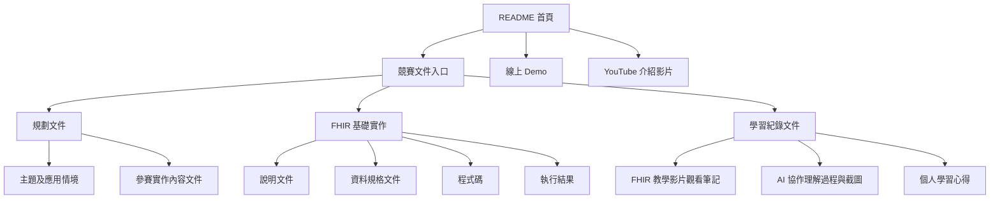

# 星澄遠征軍｜Rou Rou AI Companion

## 評審請先看這裡

本 repository 已另外整理一份給競賽評審直接閱讀的文件入口。

請優先從 [競賽文件入口](./競賽文件入口) 開始查看，內容已依競賽繳交需求拆成三大部分：

1. [規劃文件](./競賽文件入口/規劃文件)
2. [FHIR 基礎實作](./競賽文件入口/FHIR%20基礎實作)
3. [學習紀錄文件](./競賽文件入口/學習紀錄文件)



如果你希望最快掌握重點，建議閱讀順序如下：

1. [主題及應用情境](./競賽文件入口/規劃文件/主題及應用情境.md)
2. [參賽實作內容文件](./競賽文件入口/規劃文件/參賽實作內容文件.md)
3. [說明文件](./競賽文件入口/FHIR%20基礎實作/說明文件.md)
4. [資料規格文件](./競賽文件入口/FHIR%20基礎實作/資料規格文件.md)
5. [程式碼](./競賽文件入口/FHIR%20基礎實作/程式碼.md)
6. [執行結果](./競賽文件入口/FHIR%20基礎實作/執行結果.md)
7. [學習心得](./競賽文件入口/學習紀錄文件/個人學習心得.md)

## 競賽資訊

- 隊伍名稱：星澄遠征軍
- 作品名稱：Rou Rou AI Companion
- 主題領域：醫療資訊 / 心理健康
- 使用者角色：病人、醫師、心理健康照護相關人員
- 核心 FHIR Resources：Patient、Encounter、Observation、QuestionnaireResponse、Composition、DocumentReference、Provenance

## 專案簡介

Rou Rou AI Companion 現在已經不只是單純聊天展示，而是以「病人診前整理 + 醫師工作台 + FHIR 交付草稿」串成一條完整流程的心理健康支援系統。  
使用者可以先透過自然語言描述近期情緒、睡眠、壓力、功能影響與生活困擾，系統再把對話內容整理成：

- 醫師摘要
- 病人審閱稿
- FHIR Draft / FHIR Bundle
- 治療性記憶與個人化理解
- 可回看的對話紀錄與報表快取

本專案的目標不是讓 AI 直接做醫療診斷，而是降低病人的表達門檻，提升醫療端閱讀效率，並把對話資料轉換成可驗證、可交換的標準格式。

目前整體產品定位已明確聚焦在：**協助憂鬱症病患於回診前整理情緒、功能影響與量表線索，讓病人先完成自我審閱，再把整理後的重點交給醫療端理解與追蹤。**

## 直接使用

如果你只是想直接體驗，不需要先下載專案。

- 線上 Demo：[https://fhir-xingcheng.vercel.app](https://fhir-xingcheng.vercel.app)
- YouTube 介紹影片：[https://youtu.be/xgSwaATVUeA](https://youtu.be/xgSwaATVUeA)

建議使用方式：

1. 想直接操作系統：打開線上 Demo
2. 想先快速理解功能：先看 YouTube 介紹影片
3. 想看完整競賽交付：進入 [競賽文件入口](./競賽文件入口)
4. 想看程式與技術細節：再閱讀本 README 後半段與原始程式碼

## 系統亮點

- AI 陪伴式對話，可先接住情緒，再逐步整理重要資訊
- 支援多種互動模式，例如樹洞模式、靈魂陪伴、任務引導、選項引導與自動分流
- 內建治療性記憶，會逐步記住壓力來源、觸發點、正向錨點與溝通偏好
- 支援登入後的病人端 / 醫師端分流，可依身份進入不同工作畫面
- 支援醫師摘要、病人審閱稿、FHIR Draft、FHIR Bundle 按需輸出
- 支援病人授權後再送出，不是對話一結束就自動上傳
- 可將整理結果映射成 FHIR / TW Core 導向結構
- 首頁已支援保留上一段對話、釘選對話、切換歷史報表與續聊
- 已加入病人自評、PHQ-9 / HAM-D 線索整理與報表視圖
- 醫師工作台可查看病人列表、AI 摘要、病歷摘要與指派資訊
- 已支援 OpenRouter / Google Gemini / Groq 等模型來源
- 線上展示版不需要使用者自行填 API key

## 評審文件快速導覽

### 1. 規劃文件

- [主題及應用情境](./競賽文件入口/規劃文件/主題及應用情境.md)
- [參賽實作內容文件](./競賽文件入口/規劃文件/參賽實作內容文件.md)

### 2. FHIR 基礎實作

- [說明文件](./競賽文件入口/FHIR%20基礎實作/說明文件.md)
- [資料規格文件](./競賽文件入口/FHIR%20基礎實作/資料規格文件.md)
- [程式碼](./競賽文件入口/FHIR%20基礎實作/程式碼.md)
- [執行結果](./競賽文件入口/FHIR%20基礎實作/執行結果.md)

### 3. 學習紀錄文件

- [FHIR 教學影片觀看筆記](./競賽文件入口/學習紀錄文件/FHIR%20教學影片觀看筆記)
- [與 AI 互動使用說明、理解過程與截圖](./競賽文件入口/學習紀錄文件/與%20AI%20互動使用說明、理解過程與截圖)
- [個人學習心得](./競賽文件入口/學習紀錄文件/個人學習心得.md)

## 目前推薦的使用方式

### 方式一：直接使用線上版

適合評審、老師、一般體驗者。

- 入口：[https://fhir-xingcheng.vercel.app](https://fhir-xingcheng.vercel.app)
- 不需要下載專案
- 不需要自行設定 API key
- 可直接體驗登入、聊天、記憶、報表、醫病流程切換與 FHIR 相關流程

### 方式二：先看影片理解系統

適合想先快速掌握整體概念的人。

- 影片：[https://youtu.be/xgSwaATVUeA](https://youtu.be/xgSwaATVUeA)
- 可先了解系統定位、互動流程、臨床整理邏輯與展示方式

### 方式三：閱讀競賽文件入口

適合評審、老師、想快速查閱交付成果的人。

- 入口：[競賽文件入口](./競賽文件入口)
- 已依競賽要求整理為規劃文件、FHIR 基礎實作、學習紀錄文件

### 方式四：本機啟動開發版

適合要讀程式、改功能、做本地測試的人。

## 本機執行方式

### 1. 環境需求

- Node.js 18 以上
- Windows PowerShell 或其他可執行 Node.js 的終端機

### 2. 啟動本地伺服器

```powershell
node app\fhirDeliveryServer.js
```

啟動後可開啟：

- [http://localhost:8787/](http://localhost:8787/)
- [http://localhost:8787/health](http://localhost:8787/health)

目前本地伺服器會一併提供：

- 前端單頁介面
- `/api/auth/*` 登入 / 註冊 / 目前使用者 API
- `/api/chat/*` 對話、輸出、session 與歷史資料 API
- `/api/fhir/*` FHIR 交付相關 API
- 本地測試用的會話保存與摘要快取能力

FHIR 預設測試目標：

- [https://hapi.fhir.org/baseR4](https://hapi.fhir.org/baseR4)

### 3. AI 模型設定

目前專案支援：

- OpenRouter
- Google Gemini
- Groq

如果你要在本機自行指定模型，可使用 `.env.local`。

先複製：

```powershell
Copy-Item .env.example .env.local
```

再依需求填入。

OpenRouter 範例：

```env
LLM_PROVIDER=openrouter
OPENROUTER_API_BASE_URL=https://openrouter.ai/api/v1
OPENROUTER_API_KEY=YOUR_OPENROUTER_API_KEY
LLM_MODEL=openai/gpt-4o-mini
```

Google Gemini 範例：

```env
LLM_PROVIDER=google
GOOGLE_API_BASE_URL=https://generativelanguage.googleapis.com/v1beta
GOOGLE_API_KEY=YOUR_GOOGLE_API_KEY
```

Groq 範例：

```env
LLM_PROVIDER=groq
GROQ_API_BASE_URL=https://api.groq.com/openai/v1
GROQ_API_KEY=YOUR_GROQ_API_KEY
```

說明：

- `.env.local` 不會被提交到 git
- 若未另外覆蓋，本地會讀取目前的預設設定
- 線上展示版不需要使用者自己填 API key
- 若只想驗證 UI / session / 醫病流程，也可先不更換模型設定，使用目前展示環境邏輯查看畫面與流程

## 主要功能

### 1. AI 陪伴對話

- 接住病人的自然語言輸入
- 根據內容切換互動模式
- 可處理情緒困擾、壓力、睡眠、功能影響等主題
- 支援首頁續聊、建立新對話、釘選重要對話

### 2. 治療性記憶

- 累積壓力來源
- 累積情緒觸發點
- 記住正向錨點與偏好
- 記住溝通風格
- 支援摘要壓縮與個人化記憶內容回顯

### 3. 按需輸出

- 醫師摘要
- 病人審閱稿
- FHIR Draft
- FHIR Bundle / 技術示意片段
- 交付前檢查與授權流程
- 可依不同對話切換報表與查看歷史輸出

### 4. FHIR / TW Core 導向整合

- 將對話內容映射為結構化資料
- 提供後續交付與互通的實作基礎
- 支援 HAPI FHIR 測試環境驗證
- 支援送出前刪除草稿、重建草稿與檢查資源數

## Repository 結構

- [競賽文件入口](./競賽文件入口)：給評審與老師快速查閱的主要交付入口
- [工程文件入口](./工程文件入口)：較完整的內部工程文件、技術整理、決賽更新稿與導師互動對照文件
- [app](./app)：前端主介面、Node 伺服器、FHIR builder、AI 引擎、記憶模組與測試檔
- [api](./api)：Vercel / serverless 風格的 auth、chat、FHIR 與 shared API 入口
- [ai_assets](./ai_assets)：AI 提示資產、狀態 schema、chatflow 藍圖與轉換資料
- [tools](./tools)：開發用工具腳本，包含 AI 歷程 PDF 輸出與資產建置工具
- [tmp](./tmp)：本地執行過程產生的暫存輸出與測試資料

## 補充說明

- 本專案目前主線以 `master` 為主
- `main` 保留為較早期的另一條演進分支，不是目前主要展示內容
- README 以目前可操作版本為主，若競賽交付、導師互動紀錄與工程整理需要深讀，請優先查看 [工程文件入口](./工程文件入口) 與 [競賽文件入口](./競賽文件入口)
- 若 README、舊資料夾名稱或歷史檔案間有不一致，評審請優先以 [競賽文件入口](./競賽文件入口) 內容為準

## License / 使用說明

本 repository 主要作為競賽展示、技術驗證與開發紀錄使用。若需進一步引用或延伸使用，建議先聯絡作者確認。

