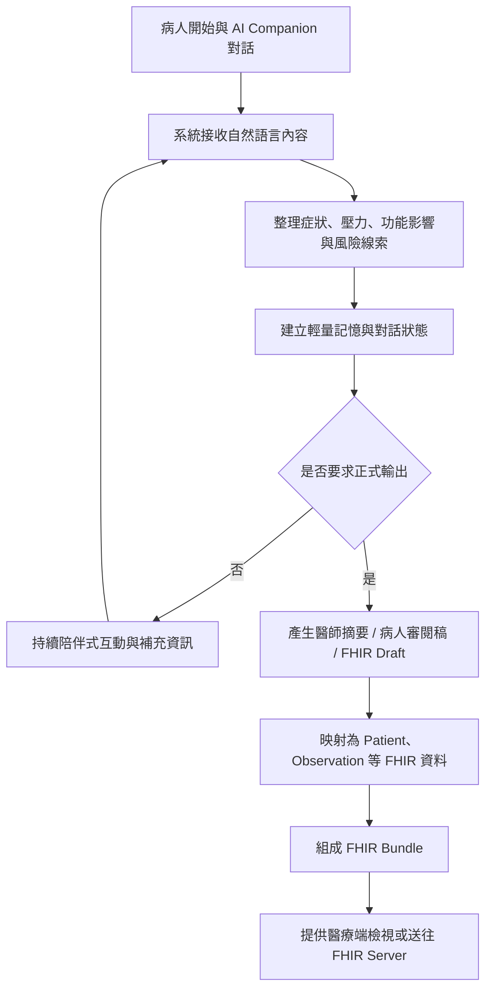

# 參賽實作內容文件

## 1. 專案名稱

**AI Companion 心理健康對話整合與 FHIR 臨床交換系統**

---

## 2. 專案簡介

本專案的核心目標，是建立一個可與病人互動的 AI Companion 對話系統，協助病人在就醫前先整理情緒困擾、壓力來源、睡眠狀況、危險訊號與主觀症狀，再將這些對話內容轉換成醫療端較容易閱讀的摘要，並進一步映射成符合 FHIR / TW Core 概念的結構化資料。

這個系統不把 AI 當成診斷者，而是把 AI 視為「診前整理工具」、「病人表達輔助工具」與「臨床資料交換的前處理工具」。病人在與 AI 對話的過程中，可以逐步說出自己的狀況；系統則在背景中把重點整理成可供醫護人員使用的資訊，降低病人難以開口、描述零散、醫護端難以快速掌握重點的問題。

---

## 3. 情境敘述（發生什麼事）

在心理健康、身心科、精神科或長期情緒照護情境中，病人在正式看診前，常常會遇到以下問題：

- 不知道該怎麼描述自己的困擾
- 想講的事情很多，但進到診間後時間有限，容易遺漏重點
- 情緒、睡眠、壓力、人際與工作功能等資訊分散在不同敘述裡，醫師不容易快速整理
- 如果病人需要跨院、跨系統或跨照護團隊轉介，資料格式不一致，交換不易

本專案設定的實際情境如下：

1. 病人在看診前，先透過 AI Companion 聊天介面描述近期狀況，例如失眠、焦慮、低落、自責、工作無法專心、與家人關係緊張等。
2. AI Companion 會依照對話內容進行陪伴式互動，並逐步整理出重要線索，例如症狀、壓力來源、功能影響與風險提示。
3. 當病人希望整理成正式資料時，系統可按需求產出「醫師摘要」、「病人審閱稿」與「FHIR Draft」。
4. 這些整理後的資料可提供給醫療端查看，或進一步轉為 FHIR Bundle，作為未來與 HIS、EHR、FHIR Server 整合的基礎。

簡單來說，這個專案處理的是一個很常見但很困難的問題：

**病人有很多重要資訊，但不容易在有限時間內清楚表達；醫護人員需要快速掌握重點，系統也需要能交換標準化資料。**

---

## 4. 情境目標（要解決什麼問題 / 為什麼要做）

### 4.1 現況痛點

目前心理健康相關就醫流程中，常見痛點包括：

- 病人描述內容非常口語化、片段化，難以直接用於臨床判讀
- 看診時間有限，醫師需要快速掌握症狀變化、風險訊號與功能影響
- 病人對自己的狀態可能有表達障礙、羞於啟齒，或因情緒低落而無法有條理說明
- 若資料要進入醫療資訊系統，不只要有文字摘要，還需要有結構化資料
- 院內外系統常使用不同格式，若沒有標準交換格式，資料難以重用
- AI 對話工具若只停留在聊天層，無法真正接到醫療流程中

### 4.2 本專案目標

本專案希望改善上述問題，具體目標如下：

- 讓病人在看診前有一個低壓力、可逐步表達的互動入口
- 協助病人把散亂的敘述整理成醫護人員較容易閱讀的摘要
- 將對話內容抽取成較結構化的症狀、風險、量表線索與功能狀態
- 支援 FHIR / TW Core 導向的資料表示方式，提升未來與醫療資訊系統整合的可能性
- 減少人工重複詢問、重複整理與重複輸入資料的負擔
- 讓同一份病人資料能同時服務病人端理解、醫療端閱讀與系統端交換三個面向

### 4.3 發展價值

若這類系統持續擴充，未來可延伸到：

- 診前收案與初步分流
- 遠距心理照護
- 慢性情緒追蹤
- 機構間標準化轉介資料交換
- 與量表、風險偵測、照護計畫系統整合

---

## 5. 需求分析（要有什麼功能）

以下以使用者需求角度說明本專案的必備功能，不使用過多工程術語。

### 5.1 病人互動功能

- 病人可以用自然語言描述自己的情緒與生活狀況
- 系統可以根據病人輸入持續對話，而不是只能填固定表單
- 病人可以在對話過程中逐步補充資訊，而不必一次講完

### 5.2 重要資訊整理功能

- 系統要能整理病人的主要困擾與症狀重點
- 系統要能辨識與整理睡眠、情緒、壓力、人際、工作功能等資訊
- 系統要能提示高風險內容，避免重要警訊被忽略

### 5.3 臨床閱讀功能

- 醫師或醫護人員要能快速看到整理後的重點摘要
- 摘要內容要包含病人主述、症狀線索、風險提示與需要追問的部分
- 醫療端看到的內容要比原始聊天紀錄更容易理解與使用

### 5.4 病人審閱功能

- 病人可以看到系統整理後的內容
- 病人可以確認這些整理是否符合自己的原意
- 病人版本內容應比醫師版更容易閱讀

### 5.5 結構化交換功能

- 系統要能把整理後的資料轉成標準化格式
- 這些資料要能對應到 FHIR 的核心資料類型
- 後續不同系統若支援 FHIR，就有機會讀取同一份資料

### 5.6 安全與流程控制功能

- 高風險訊息需要特別標示
- 一般聊天不應每輪都產出過重的醫療文件，避免資源浪費
- 只有在需要時才產出正式摘要與 FHIR 交付資料

---

## 6. 工作流程（系統怎麼動）

以下用生活邏輯描述本系統的運作方式。

### 6.1 文字版流程

1. 病人打開 AI Companion，開始描述自己最近的情緒與困擾。
2. AI Companion 以陪伴式對話方式回應，並持續蒐集重要資訊。
3. 系統在背景中整理病人的症狀線索、情緒狀態、功能影響與風險訊號。
4. 若病人只是一般聊天，系統維持輕量互動與重點記憶，不強制每輪產生完整醫療文件。
5. 當病人或操作人員需要正式資料時，可要求系統產出醫師摘要、病人審閱稿或 FHIR Draft。
6. 系統把結構化資訊轉換成對應的 FHIR Resource。
7. 多個 FHIR Resource 再被整理成 Bundle，供後續展示、驗證或送往 FHIR Server。
8. 醫師在看診前或看診時，即可快速檢視病人整理後的重點內容。

### 6.2 流程圖

### 6.3 專案中的實際流程設計重點

本專案不是把每一輪對話都直接變成完整病歷，而是採用兩層式流程：

- **聊天層**：負責陪伴、收集、辨識模式、追問與風險判斷
- **輸出層**：只有在明確需要時，才整理成醫師摘要、病人審閱稿與 FHIR Draft

這種設計的好處是：

- 對話更自然，不會每輪都進行重度運算
- 降低系統資源消耗
- 較符合真實醫療流程，因為正式文件通常只在必要時產生

---

## 7. 使用角色（誰會使用系統）

### 7.1 病人

- 使用對話介面描述自己的困擾
- 補充情緒、睡眠、壓力、人際與功能相關資訊
- 檢視病人審閱版本，確認內容是否符合自身情況

### 7.2 醫師

- 在看診前或看診時快速查看病人整理後的摘要
- 了解病人的主要困擾、症狀趨勢、風險訊號與需追問項目
- 作為臨床訪談與判斷的輔助資料

### 7.3 護理師 / 個管師 / 心理師

- 協助病人使用系統
- 查看病人互動後的整理內容
- 作為後續照護、分流或追蹤的參考

### 7.4 系統管理者 / 資訊人員

- 維護系統運作
- 管理對接流程與資料交換設定
- 驗證 FHIR 資料是否符合預期格式

---

## 8. 主要 FHIR Resource（最基本的資料種類）

本專案會用到的核心 FHIR Resource 如下。為了符合競賽文件閱讀習慣，先列最主要的，再補充其用途。

### 8.1 最核心的 Resource

- **Patient**：病人的基本資料，例如姓名、生日、識別資料
- **Encounter**：本次互動或就醫情境，用來表示這次會談或看診事件
- **Practitioner**：醫護人員或照護專業人員資訊
- **Observation**：病人的症狀、量測結果、風險線索或評估觀察結果
- **QuestionnaireResponse**：病人在互動中回答的問題與量表型資訊

### 8.2 本專案延伸重要 Resource

- **Composition**：整理給醫師閱讀的整份臨床摘要文件
- **DocumentReference**：若要保留病人審閱稿、摘要文件或附件，可用此資源描述
- **Provenance**：紀錄資料來源、生成方式與審閱關係，對 AI 輔助場景非常重要

### 8.3 各 Resource 在本專案中的角色

#### Patient

表示病人本人，是所有臨床資料的主體。系統產出的 Observation、QuestionnaireResponse、Composition 等都需要能連回同一位病人。

#### Encounter

表示這一次互動情境，例如一次診前 AI 對談、一次門診事件或一次照護接觸。它能把同一輪對話中產生的資料串在一起。

#### Practitioner

表示醫師、護理師、心理師或其他專業人員。當摘要文件或後續臨床流程需要標示照護參與者時會使用。

#### Observation

這是本專案很重要的 Resource。病人的睡眠差、情緒低落、焦慮、工作功能下降、風險警訊等，都可以整理成 Observation，提供臨床端進一步判讀。

#### QuestionnaireResponse

當系統在對話中逐步蒐集近似量表或結構化問答資訊時，可以用 QuestionnaireResponse 表示原始回答，保留病人回答脈絡。

#### Composition

如果醫師需要一份可以直接閱讀的診前摘要，最適合用 Composition 表示。它不是單一數值，而是一份由多個段落組成的臨床文件。

#### DocumentReference

若需要保存病人可閱讀版本、已匯出的摘要或後續附件，可以使用 DocumentReference 作為文件索引。

#### Provenance

AI 輔助資料必須清楚知道「這份資料從哪裡來、誰產生、誰確認」。Provenance 可以補足這件事，讓資料更有可追溯性。

---

## 9. 系統架構概念

### 9.1 前端層

- 提供聊天介面
- 讓病人輸入自然語言內容
- 提供按鈕觸發醫師摘要、病人審閱稿與 FHIR Draft

### 9.2 AI 對話處理層

- 接收病人訊息
- 進行模式判斷、風險偵測與追問邏輯
- 更新輕量記憶狀態

### 9.3 輸出整理層

- 依需求生成醫師摘要
- 依需求生成病人審閱稿
- 依需求生成 FHIR Draft 與 session export

### 9.4 FHIR 映射與交付層

- 將整理後資料映射為 FHIR Resource
- 組合成 Bundle
- 提供本地 API 或後續外部 FHIR Server 傳送能力

---

## 10. 本專案的實作重點

### 10.1 對話不等於病歷，但可以成為病歷前處理

本專案的重點不是把聊天記錄直接丟進醫療系統，而是先把對話內容做整理、分層與結構化，再轉成較有醫療價值的資料。這比單純聊天機器人更接近實際醫療應用。

### 10.2 採用「輕量記憶 + 按需輸出」架構

系統平常聊天時只保留關鍵資訊，避免每輪都重複產出完整摘要。當使用者真的需要時，再生成正式文件與 FHIR 資料，提升效率與可用性。

### 10.3 兼顧病人端與醫療端

同一份互動資料，不只要讓醫師看得懂，也要讓病人能審閱。這代表系統不能只做技術交換，還要兼顧溝通與理解。

### 10.4 保留未來接軌 TW Core 的空間

目前專案已具備 FHIR 交付層雛形，未來若依照台灣實作指引補強 profile、欄位驗證與授權流程，即可更接近真實部署。

---

## 11. 預期效益

### 11.1 對病人

- 較容易表達自己的狀況
- 降低面對醫師前的緊張與混亂
- 可以先整理再就醫，提高溝通品質

### 11.2 對醫護人員

- 更快掌握病人重點
- 減少重複詢問與重新整理時間
- 提高診前資訊可讀性

### 11.3 對醫療資訊整合

- 有利於資料標準化
- 有利於跨系統交換
- 讓 AI 工具更容易進入正式流程，而不只是展示型聊天功能

---

## 12. 本次競賽可展示成果

本專案在競賽展示時，可具體呈現以下內容：

- 病人與 AI Companion 的實際互動流程
- 系統如何從自然語言整理出重點
- 如何產生醫師摘要與病人審閱稿
- 如何將整理結果轉成 FHIR Draft / FHIR Bundle
- 如何展示與醫療標準接軌的可能性

這樣的展示方式可以同時呈現：

- 使用情境
- 問題解決能力
- 系統設計完整度
- 與國際醫療資料標準接軌的技術價值

---

## 13. 結論

本專案不是單純的聊天機器人，也不是單純的 FHIR 格式轉換工具，而是把「病人表達」、「AI 協助整理」與「醫療資料標準交換」三件事情串起來的一個實作方案。

它所要解決的核心問題，是病人資料雖然存在，卻常常不容易被清楚說出、不容易被快速理解，也不容易被不同系統共用。本系統透過 AI 對話互動降低表達門檻，再透過摘要整理與 FHIR 映射提升資料可讀性與可交換性，讓病人端、醫療端與資訊系統端之間能有更順暢的連結。

若持續深化，本專案未來有機會成為心理健康、慢性照護與跨院資料整合的重要基礎工具。
