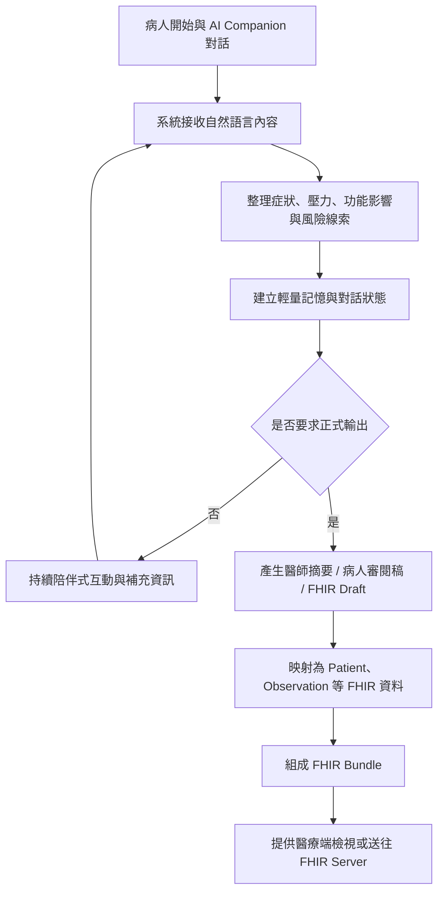
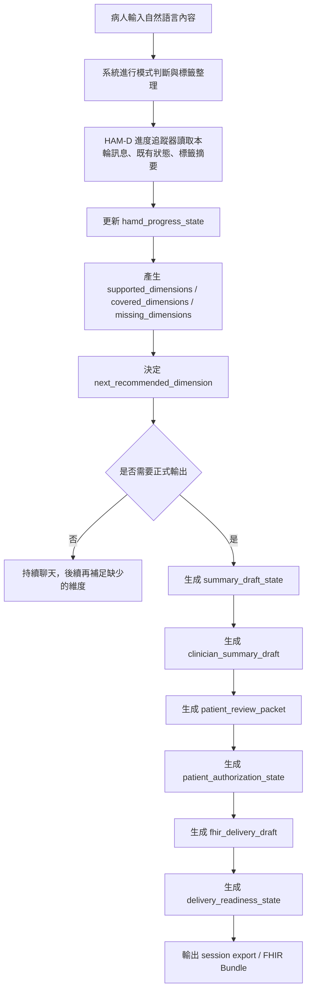

# 參賽實作內容文件

## 1. 專案名稱

**AI Companion 心理健康對話整合與 FHIR 臨床交換系統**

---

## 2. 專案簡介

本專案的核心目標，是建立一個可與病人互動的 AI Companion 對話系統，協助病人在就醫前先整理情緒困擾、壓力來源、睡眠狀況、危險訊號與主觀症狀，再將這些對話內容轉換成醫療端較容易閱讀的摘要，並進一步映射成符合 FHIR / TW Core 概念的結構化資料。

這個系統不把 AI 當成診斷者，而是把 AI 視為「診前整理工具」、「病人表達輔助工具」與「臨床資料交換的前處理工具」。病人在與 AI 對話的過程中，可以逐步說出自己的狀況；系統則在背景中把重點整理成可供醫護人員使用的資訊，降低病人難以開口、描述零散、醫護端難以快速掌握重點的問題。

---

## 3. 情境敘述（發生什麼事）

在心理健康、身心科、精神科或長期情緒照護情境中，病人在正式看診前，常常會遇到以下問題：

- 不知道該怎麼描述自己的困擾
- 想講的事情很多，但進到診間後時間有限，容易遺漏重點
- 情緒、睡眠、壓力、人際與工作功能等資訊分散在不同敘述裡，醫師不容易快速整理
- 如果病人需要跨院、跨系統或跨照護團隊轉介，資料格式不一致，交換不易

本專案設定的實際情境如下：

1. 病人在看診前，先透過 AI Companion 聊天介面描述近期狀況，例如失眠、焦慮、低落、自責、工作無法專心、與家人關係緊張等。
2. AI Companion 會依照對話內容進行陪伴式互動，並逐步整理出重要線索，例如症狀、壓力來源、功能影響與風險提示。
3. 當病人希望整理成正式資料時，系統可按需求產出「醫師摘要」、「病人審閱稿」與「FHIR Draft」。
4. 這些整理後的資料可提供給醫療端查看，或進一步轉為 FHIR Bundle，作為未來與 HIS、EHR、FHIR Server 整合的基礎。

簡單來說，這個專案處理的是一個很常見但很困難的問題：

**病人有很多重要資訊，但不容易在有限時間內清楚表達；醫護人員需要快速掌握重點，系統也需要能交換標準化資料。**

---

## 4. 情境目標（要解決什麼問題 / 為什麼要做）

### 4.1 現況痛點

目前心理健康相關就醫流程中，常見痛點包括：

- 病人描述內容非常口語化、片段化，難以直接用於臨床判讀
- 看診時間有限，醫師需要快速掌握症狀變化、風險訊號與功能影響
- 病人對自己的狀態可能有表達障礙、羞於啟齒，或因情緒低落而無法有條理說明
- 若資料要進入醫療資訊系統，不只要有文字摘要，還需要有結構化資料
- 院內外系統常使用不同格式，若沒有標準交換格式，資料難以重用
- AI 對話工具若只停留在聊天層，無法真正接到醫療流程中

### 4.2 本專案目標

本專案希望改善上述問題，具體目標如下：

- 讓病人在看診前有一個低壓力、可逐步表達的互動入口
- 協助病人把散亂的敘述整理成醫護人員較容易閱讀的摘要
- 將對話內容抽取成較結構化的症狀、風險、量表線索與功能狀態
- 支援 FHIR / TW Core 導向的資料表示方式，提升未來與醫療資訊系統整合的可能性
- 減少人工重複詢問、重複整理與重複輸入資料的負擔
- 讓同一份病人資料能同時服務病人端理解、醫療端閱讀與系統端交換三個面向

### 4.3 發展價值

若這類系統持續擴充，未來可延伸到：

- 診前收案與初步分流
- 遠距心理照護
- 慢性情緒追蹤
- 機構間標準化轉介資料交換
- 與量表、風險偵測、照護計畫系統整合

---

## 5. 需求分析（要有什麼功能）

以下以使用者需求角度說明本專案的必備功能，不使用過多工程術語。

### 5.1 病人互動功能

- 病人可以用自然語言描述自己的情緒與生活狀況
- 系統可以根據病人輸入持續對話，而不是只能填固定表單
- 病人可以在對話過程中逐步補充資訊，而不必一次講完

### 5.2 重要資訊整理功能

- 系統要能整理病人的主要困擾與症狀重點
- 系統要能辨識與整理睡眠、情緒、壓力、人際、工作功能等資訊
- 系統要能提示高風險內容，避免重要警訊被忽略

### 5.3 臨床閱讀功能

- 醫師或醫護人員要能快速看到整理後的重點摘要
- 摘要內容要包含病人主述、症狀線索、風險提示與需要追問的部分
- 醫療端看到的內容要比原始聊天紀錄更容易理解與使用

### 5.4 病人審閱功能

- 病人可以看到系統整理後的內容
- 病人可以確認這些整理是否符合自己的原意
- 病人版本內容應比醫師版更容易閱讀

### 5.5 結構化交換功能

- 系統要能把整理後的資料轉成標準化格式
- 這些資料要能對應到 FHIR 的核心資料類型
- 後續不同系統若支援 FHIR，就有機會讀取同一份資料

### 5.6 安全與流程控制功能

- 高風險訊息需要特別標示
- 一般聊天不應每輪都產出過重的醫療文件，避免資源浪費
- 只有在需要時才產出正式摘要與 FHIR 交付資料

---

## 6. 工作流程（系統怎麼動）

以下用生活邏輯描述本系統的運作方式。

### 6.1 文字版流程

1. 病人打開 AI Companion，開始描述自己最近的情緒與困擾。
2. AI Companion 以陪伴式對話方式回應，並持續蒐集重要資訊。
3. 系統在背景中整理病人的症狀線索、情緒狀態、功能影響與風險訊號。
4. 若病人只是一般聊天，系統維持輕量互動與重點記憶，不強制每輪產生完整醫療文件。
5. 當病人或操作人員需要正式資料時，可要求系統產出醫師摘要、病人審閱稿或 FHIR Draft。
6. 系統把結構化資訊轉換成對應的 FHIR Resource。
7. 多個 FHIR Resource 再被整理成 Bundle，供後續展示、驗證或送往 FHIR Server。
8. 醫師在看診前或看診時，即可快速檢視病人整理後的重點內容。

### 6.2 流程圖

### 6.3 專案中的實際流程設計重點

本專案不是把每一輪對話都直接變成完整病歷，而是採用兩層式流程：

- **聊天層**：負責陪伴、收集、辨識模式、追問與風險判斷
- **輸出層**：只有在明確需要時，才整理成醫師摘要、病人審閱稿與 FHIR Draft

這種設計的好處是：

- 對話更自然，不會每輪都進行重度運算
- 降低系統資源消耗
- 較符合真實醫療流程，因為正式文件通常只在必要時產生

---

## 7. 使用角色（誰會使用系統）

### 7.1 病人

- 使用對話介面描述自己的困擾
- 補充情緒、睡眠、壓力、人際與功能相關資訊
- 檢視病人審閱版本，確認內容是否符合自身情況

### 7.2 醫師

- 在看診前或看診時快速查看病人整理後的摘要
- 了解病人的主要困擾、症狀趨勢、風險訊號與需追問項目
- 作為臨床訪談與判斷的輔助資料

### 7.3 護理師 / 個管師 / 心理師

- 協助病人使用系統
- 查看病人互動後的整理內容
- 作為後續照護、分流或追蹤的參考

### 7.4 系統管理者 / 資訊人員

- 維護系統運作
- 管理對接流程與資料交換設定
- 驗證 FHIR 資料是否符合預期格式

---

## 8. 主要 FHIR Resource（最基本的資料種類）

本專案會用到的核心 FHIR Resource 如下。為了符合競賽文件閱讀習慣，先列最主要的，再補充其用途。

### 8.1 最核心的 Resource

- **Patient**：病人的基本資料，例如姓名、生日、識別資料
- **Encounter**：本次互動或就醫情境，用來表示這次會談或看診事件
- **Practitioner**：醫護人員或照護專業人員資訊
- **Observation**：病人的症狀、量測結果、風險線索或評估觀察結果
- **QuestionnaireResponse**：病人在互動中回答的問題與量表型資訊

### 8.2 本專案延伸重要 Resource

- **Composition**：整理給醫師閱讀的整份臨床摘要文件
- **DocumentReference**：若要保留病人審閱稿、摘要文件或附件，可用此資源描述
- **Provenance**：紀錄資料來源、生成方式與審閱關係，對 AI 輔助場景非常重要

### 8.3 各 Resource 在本專案中的角色

#### Patient

表示病人本人，是所有臨床資料的主體。系統產出的 Observation、QuestionnaireResponse、Composition 等都需要能連回同一位病人。

#### Encounter

表示這一次互動情境，例如一次診前 AI 對談、一次門診事件或一次照護接觸。它能把同一輪對話中產生的資料串在一起。

#### Practitioner

表示醫師、護理師、心理師或其他專業人員。當摘要文件或後續臨床流程需要標示照護參與者時會使用。

#### Observation

這是本專案很重要的 Resource。病人的睡眠差、情緒低落、焦慮、工作功能下降、風險警訊等，都可以整理成 Observation，提供臨床端進一步判讀。

#### QuestionnaireResponse

當系統在對話中逐步蒐集近似量表或結構化問答資訊時，可以用 QuestionnaireResponse 表示原始回答，保留病人回答脈絡。

#### Composition

如果醫師需要一份可以直接閱讀的診前摘要，最適合用 Composition 表示。它不是單一數值，而是一份由多個段落組成的臨床文件。

#### DocumentReference

若需要保存病人可閱讀版本、已匯出的摘要或後續附件，可以使用 DocumentReference 作為文件索引。

#### Provenance

AI 輔助資料必須清楚知道「這份資料從哪裡來、誰產生、誰確認」。Provenance 可以補足這件事，讓資料更有可追溯性。

---

## 9. 系統架構概念

### 9.1 前端層

- 提供聊天介面
- 讓病人輸入自然語言內容
- 提供按鈕觸發醫師摘要、病人審閱稿與 FHIR Draft

### 9.2 AI 對話處理層

- 接收病人訊息
- 進行模式判斷、風險偵測與追問邏輯
- 更新輕量記憶狀態

### 9.3 輸出整理層

- 依需求生成醫師摘要
- 依需求生成病人審閱稿
- 依需求生成 FHIR Draft 與 session export

### 9.4 FHIR 映射與交付層

- 將整理後資料映射為 FHIR Resource
- 組合成 Bundle
- 提供本地 API 或後續外部 FHIR Server 傳送能力

---

## 10. 本專案的實作重點

### 10.1 對話不等於病歷，但可以成為病歷前處理

本專案的重點不是把聊天記錄直接丟進醫療系統，而是先把對話內容做整理、分層與結構化，再轉成較有醫療價值的資料。這比單純聊天機器人更接近實際醫療應用。

### 10.2 採用「輕量記憶 + 按需輸出」架構

系統平常聊天時只保留關鍵資訊，避免每輪都重複產出完整摘要。當使用者真的需要時，再生成正式文件與 FHIR 資料，提升效率與可用性。

### 10.3 兼顧病人端與醫療端

同一份互動資料，不只要讓醫師看得懂，也要讓病人能審閱。這代表系統不能只做技術交換，還要兼顧溝通與理解。

### 10.4 保留未來接軌 TW Core 的空間

目前專案已具備 FHIR 交付層雛形，未來若依照台灣實作指引補強 profile、欄位驗證與授權流程，即可更接近真實部署。

### 10.5 HAM-D 評估流程與系統處理方式

本專案中的 HAM-D 並不是以傳統紙本量表逐題作答的方式進行，而是以「自然對話中的症狀線索整理」為核心。系統會在病人與 AI Companion 對話時，持續從語句內容、症狀描述、情緒表達與功能影響中，整理出可對應到 HAM-D 維度的線索，並逐步更新 `hamd_progress_state`。

目前系統追蹤的 HAM-D 維度包括：

- `depressed_mood`
- `guilt`
- `work_interest`
- `retardation`
- `agitation`
- `somatic_anxiety`
- `insomnia`

也就是說，系統不是直接宣稱病人得到某個正式量表分數，而是根據對話證據整理出：

- 本輪觸及了哪些 HAM-D 面向
- 整體累積覆蓋了哪些維度
- 目前還缺哪些面向
- 下一輪最值得追蹤的維度是什麼
- 支持這些判斷的近期語句證據是什麼

### 10.6 HAM-D 評估流程圖

### 10.7 哪些環節會進行 HAM-D 評估

本專案中，真正會更新 HAM-D 狀態的環節主要有以下幾個：

#### （1）一般對話回合中的 HAM-D 線索更新

每當病人送出一輪對話內容，系統都可能根據這一輪訊息更新 `hamd_progress_state`。這個更新不是只在任務模式才發生，而是只要出現可映射的症狀線索，就可以觸發。也就是說：

- `natural` 模式會更新
- `option` 模式會更新
- `clarify` 模式會更新
- `follow-up` 前的自然補充也會更新
- `mission` 模式則會更明確地沿著某一個維度往前推進

這個環節是整個 HAM-D 線索評估的核心。

#### （2）任務引導模式中的維度推進

當系統進入 `mission` 模式時，會優先參考 `next_recommended_dimension`，選擇目前最值得追蹤的一個 HAM-D 面向來前進。這代表系統不會一次把所有維度都硬問完，而是根據：

- 目前已經蒐集到的證據
- 尚未覆蓋的維度
- 病人的互動負擔

去決定下一步最自然、最合適的追問方向。

#### （3）醫師摘要生成前的 HAM-D 線索整理

在正式生成醫師端摘要前，系統會把目前 `hamd_progress_state` 中已收斂出的內容，整理成：

- `symptom_observations`
- `hamd_signals`

因此醫師看到的不是原始聊天紀錄，而是經過 HAM-D 線索整理後的重點摘要。

### 10.8 HAM-D 評估輸出欄位說明

系統目前與 HAM-D 最直接相關的狀態欄位是 `hamd_progress_state`。其內容重點包括：

- `current_focus`：目前主要聚焦的 HAM-D 維度
- `supported_dimensions`：本輪對話中有新證據支持的維度
- `covered_dimensions`：到目前為止已累積覆蓋到的維度
- `missing_dimensions`：尚未有足夠線索的維度
- `next_recommended_dimension`：下一輪建議優先追蹤的維度
- `recent_evidence`：支持目前判斷的近期語句證據
- `status_summary`：目前 HAM-D 線索整理的簡要摘要

這些內容後續會被：

- 前端報表用來顯示「HAM-D 評估進度」
- 醫師摘要用來整理 `hamd_signals`
- FHIR 輸出用來形成 `QuestionnaireResponse` 與 `Observation`

### 10.8.1 正式 HAM-D 題項級草稿

為了從「線索追蹤」升級到較正式的醫療評估草稿，本專案另外新增 `hamd_formal_assessment`。這個狀態與 `hamd_progress_state` 並存，前者負責正式題項級草稿，後者負責自然聊天中的維度追蹤。

`hamd_formal_assessment` 的重點包括：

- `scale_version = HAM-D17`
- `status`
- `assessment_mode`
- `recall_window`
- `items`
- `ai_total_score`
- `clinician_total_score`
- `severity_band`
- `review_flags`

其中 `items` 會逐題保存：

- 題項代碼
- 題項名稱
- 原始分制範圍（`0_to_4` 或 `0_to_2`）
- `evidence_type`
- `direct_answer_value`
- `ai_suggested_score`
- `clinician_final_score`
- `evidence_summary`
- `rating_rationale`
- `confidence`
- `review_required`

### 10.8.2 證據分型規則

正式 HAM-D 草稿不再只寫「系統判斷」，而是把每一題拆成三種證據型態：

- `direct_answer`：病人直接回答頻率、程度或量表導向內容
- `indirect_observation`：主要來自對話互動中的觀察，例如遲緩、激越、語句縮短、回應變慢
- `mixed`：同時包含病人直接回答與系統可觀察到的行為線索

這樣做的目的是讓醫師一眼看出：

- 這一題是病人自己直接說的
- 還是系統從互動中間接推估的
- 哪些題目需要後續人工覆核

### 10.8.3 Smart Hunter 的正式題項探針

在自然聊天模式 `Smart Hunter` 中，系統現在會根據 `hamd_progress_state.next_recommended_dimension` 與正式題項缺口，偶爾插入 **最多一題** 低干擾正式探針。

其原則為：

- 每次最多一題
- 保持自然語氣
- 不使用自訂 `1-10` 分
- 問法要能映射回正式 HAM-D 原始分制
- 若病人直接回答，該題就可形成 `direct_answer`
- 若仍主要靠觀察，則標記為 `indirect_observation`

這讓系統能在不破壞陪伴感的前提下，逐步把自然聊天資料轉成較正式的題項級評估草稿。

### 10.9 Draft 輸出流程與處理方式

本專案採用「由輕到重」的多階段 draft 輸出流程。也就是說，系統不會一開始就直接輸出最終文件，而是依序生成多個中介草稿狀態，再往下傳遞。這樣做的好處是每一層都可被檢查、覆用或重新整理。

目前主要輸出草稿包括：

- `summary_draft_state`
- `clinician_summary_draft`
- `patient_review_packet`
- `patient_authorization_state`
- `fhir_delivery_draft`
- `delivery_readiness_state`

### 10.10 各種 Draft 的處理順序

#### （1）`summary_draft_state`

這是第一層摘要草稿，作用是先把本輪對話與目前狀態整理成一個較短的中介摘要。它不直接給醫師使用，而是作為後續各種正式輸出的基底。

#### （2）`clinician_summary_draft`

這是醫師端最重要的臨床摘要草稿，也就是本專案中最接近 clinical draft 的狀態。它的主要作用是把前面累積到的資訊整合成醫師較容易閱讀的內容，例如：

- `chief_concerns`
- `symptom_observations`
- `followup_needs`
- `safety_flags`
- `hamd_signals`
- `draft_summary`

它的處理方式不是直接從原始聊天全文輸出，而是綜合：

- `summary_draft_state`
- `latest_tag_payload`
- `red_flag_payload`
- `hamd_progress_state`
- `burden_level_state`
- `mission_retrieval_audit` 等中介狀態

再整理出醫療端可閱讀的臨床摘要草稿。

#### （3）`patient_review_packet`

這一層是把醫師草稿轉成較適合病人閱讀與確認的版本。它會把較技術性或較臨床導向的內容，轉成病人較能理解的敘述方式，作為病人審閱依據。

#### （4）`patient_authorization_state`

這一層不是臨床內容本身，而是描述病人審閱與分享狀態，例如是否準備好授權、是否允許分享給醫師。這對後續資料交付很重要。

#### （5）`fhir_delivery_draft`

這一層會把目前整理出的臨床摘要、風險、HAM-D 線索與病人審閱狀態，進一步轉成 FHIR / TW Core 映射草稿。也就是說，這時資料開始從「臨床摘要語言」往「標準交換格式」靠攏。

#### （6）`delivery_readiness_state`

這是最後一層交付準備狀態，作用是判斷目前資料是否已足夠進入後續後端 mapping、驗證或交付流程。

### 10.11 Clinical Draft 的處理重點

若以實際臨床用途來看，本專案中的 **clinical draft** 主要就是 `clinician_summary_draft`。它的處理重點如下：

1. 不直接使用原始聊天全文，而是先經過標籤化與 HAM-D 線索整理。
2. 不把 AI 當成診斷者，而是整理出「醫師值得快速看到的重點」。
3. 把風險、症狀、待追問處與 HAM-D 線索放在同一份可讀摘要中。
4. 後續病人審閱與 FHIR 輸出，都會以這份 clinical draft 為重要基底之一。

因此，`clinician_summary_draft` 在整體系統中扮演的角色是：

- 對上承接對話整理與 HAM-D 線索
- 對下承接病人審閱與 FHIR 交付草稿

它可以視為本專案從「聊天資料」跨入「臨床可用資料」的關鍵中介層。

### 10.11.1 Clinical Draft 中的正式 HAM-D 呈現方式

升級後的 `clinician_summary_draft` 不再只有 `hamd_signals`，而是新增：

- `hamd_item_scores`
- `hamd_total_score_ai`
- `hamd_total_score_clinician`
- `hamd_severity_band`
- `hamd_evidence_table`
- `hamd_review_required_items`

也就是說，醫師端看到的不只是哪幾個維度被觸及，而是每一題會知道：

- 建議分數是多少
- 是否已有臨床最終分數
- 證據類型是什麼
- 證據摘要是什麼
- 這個分數是怎麼被判定的

若目前只有 AI 建議、尚未臨床確認，文件也會保留 draft 性質，不會假裝成最終正式量表結果。

---

## 11. PRD 補充資訊與實作狀態

為了讓本文件與產品需求規格書內容一致，以下補充 PRD 中已有、但原始規劃文件尚未完整展開的重點。每一項都附上目前專案中的實作狀態，避免文件內容超前於現況。

### 11.1 實作狀態標註說明

- **[已實作]**：目前專案中已有明確程式、畫面或可執行流程支撐
- **[部分實作]**：已有部分基礎能力，但尚未完整達成 PRD 描述
- **[規劃中 / 尚未實作]**：PRD 已定義方向，但目前仍未完整落地

### 11.2 HAM-D 作為核心評估框架

**狀態： [部分實作]**

PRD 明確將 HAM-D 作為本系統的核心評估框架，本專案也確實已在系統內建立 HAM-D 導向的追蹤結構。現有系統會在對話後更新 `hamd_progress_state`，並追蹤：

- `depressed_mood`
- `guilt`
- `work_interest`
- `retardation`
- `agitation`
- `somatic_anxiety`
- `insomnia`

目前已具備的能力，是把對話中出現的相關線索整理成 HAM-D 維度覆蓋狀態與下一步建議維度，並可進一步輸出到醫師摘要與 FHIR Draft。

但要特別註明的是，目前系統仍屬於 **AI 陪伴式整理與線索映射**，不是正式醫療量表施測工具，因此：

- 尚未形成正式醫療版 HAM-D 完整評分流程
- 目前輸出較接近「HAM-D 線索追蹤」而非「正式量表結論」

### 11.3 四大自動分類標籤架構

**狀態： [已實作]**

PRD 中的四大分類架構已經有相對應的系統基礎，主要包括：

- **情緒標籤（Sentiment Tags）**
- **行為標籤（Behavioral Tags）**
- **認知標籤（Cognitive Tags）**
- **警示標籤（Red Flags）**

現有對話引擎會將每輪對話整理成結構化標籤，並儲存在如 `latest_tag_payload`、`red_flag_payload` 等狀態中。這表示系統已經不只是單純保留聊天文本，而是會將內容轉成後續可供摘要、風險判斷與 FHIR 映射使用的中介資料。

### 11.4 HAM-D 各維度的 AI 引導策略

**狀態： [部分實作]**

PRD 針對多個 HAM-D 維度提出了對應的 AI 引導式問法與資料擷取方向，例如：

- 憂鬱情緒
- 有罪感
- 工作與興趣
- 遲緩
- 激越
- 軀體性焦慮
- 睡眠障礙

目前系統已實作的部分在於：

- 有維度追蹤邏輯
- 有 prompt-based 的狀態更新流程
- 可依目前資訊決定下一個建議追問維度

但目前尚未完全達到 PRD 所描述的「每一個維度都有一套固定、完整、可驗證的引導問法模板與量化分析規則」。也就是說，方向已建立，但臨床問法模板庫與分析規格仍有擴充空間。

### 11.5 五大對話模式

**狀態： [已實作]**

PRD 提出的五大模式，目前已有相對應實作基礎：

- `Void Box` 對應樹洞式互動
- `Soul Mate` 對應陪伴式互動
- `Mission Guide` 對應任務引導
- `Option Selector` 對應低負擔選項式互動
- `Smart Hunter` 對應自然聊天與背景擷取

在目前的系統中：

- 後端引擎已有 `void`、`soulmate`、`mission`、`option`、`natural`、`clarify` 等模式指令
- 前端已有模式切換畫面與模式卡片
- 不同模式對應不同 prompt 與互動風格

因此，PRD 中最具代表性的多模式互動設計，已經不是概念，而是已有程式與畫面支撐的功能。

### 11.6 模式切換機制

**狀態： [部分實作]**

PRD 希望模式切換同時具備：

- **自動偵測**
- **手動控制**

目前已有的部分包括：

- 使用者可在前端畫面手動切換模式
- 使用者可用文字指令切換模式
- 後端已有 `intent classifier`、`low-energy detector`、`override router` 等判斷元件

但仍需標註目前尚未完全落地的部分：

- 還沒有完整實作 PRD 中描述的所有自動降級規則
- 例如依據打字速度、極短回應、能量檢測來細緻切換的整套邏輯，仍屬 **部分實作**
- 某些規則目前較偏向 prompt routing，而不是完整的產品級自動適應引擎

### 11.7 病患審閱與授權流程

**狀態： [部分實作]**

PRD 強調病患不是被動接收者，而是資料審閱與授權的主體。現有系統已經具備以下基礎：

- 可生成病人審閱稿
- 可生成病人授權狀態資料
- 前端文案與流程已表達「確認後才送出」
- FHIR Draft 與交付前狀態中，也有病患審閱 / 分享狀態欄位

但目前尚未完整落地的部分包括：

- 病患逐項刪除敏感資訊的正式 UI 流程
- 病患新增個人備註並回寫正式交付內容的完整流程
- 真正對指定醫院 / 醫師執行正式授權送出流程

因此目前較適合描述為：**已建立審閱與授權概念流程，部分互動已實作，但完整授權操作仍待補強。**

### 11.8 隱私、法規與 OAuth 2.0 授權

**狀態： [規劃中 / 尚未實作]**

PRD 中提到：

- OAuth 2.0 數位授權
- 加密傳輸
- 符合 GDPR / 台灣個資法
- 送往醫院端 FHIR Server

這些內容目前比較接近系統設計方向，而非已完整落地功能。現況比較明確的是：

- 系統已有本地端 FHIR delivery API
- 可做 dry run 與送往外部 FHIR Server 的技術路徑

但以下部分目前尚未在專案中看到完整實作：

- 真正的 OAuth 2.0 病患授權流程
- 醫院身分整合與權限驗證
- 完整合規文件與法遵驗證
- 端到端正式加密交付機制驗證

因此，這一段在規劃文件中必須明確標示為 **規劃中**，不能誤寫成已完成。

### 11.9 醫師端報告格式與欄位

**狀態： [部分實作]**

PRD 中對醫師端報告格式描述得非常完整，包含：

- 報告編號
- 評估區間
- 資料來源
- 授權狀態
- 快速風險指標
- HAM-D 維度分析
- 關鍵事件時間線
- 病患審閱備註

目前系統已具備的基礎包括：

- 可生成醫師摘要
- 可生成病人審閱稿
- 可整理 chief concerns、symptom observations、follow-up needs、safety flags、HAM-D signals 等內容

但目前尚未完全具備：

- PRD 範例中那種完整格式化醫師報告版面
- 正式報告編號規則
- 完整時間線視覺區塊
- 完整病患備註併入醫師端正式報表的流程

因此可描述為：**摘要內容已具雛形，但完整醫師報告樣板仍屬部分實作。**

### 11.10 視覺化趨勢圖與情緒波形圖

**狀態： [規劃中 / 尚未實作]**

PRD 提到醫師端應有視覺化趨勢圖與情緒波形圖，這是很有展示價值的設計。但就目前專案狀態來看：

- 前端已有報表頁面
- 有切換不同報表視角的 UI 基礎

不過尚未看到：

- 穩定輸出的情緒波形圖元件
- HAM-D 分數趨勢圖
- 以日期為主軸的完整視覺化資料分析模組

因此這部分應明確標示為 **尚未完整實作**。

### 11.11 非同步日常互動與時間線價值

**狀態： [部分實作]**

PRD 很重要的一個產品觀點，是希望透過日常、非同步、低壓力的互動累積真實時間線，減少病人在回診時才回想造成的偏差。

這個方向在目前專案中已有基礎，因為：

- 系統支援持續對話
- 會保留 session 與狀態資料
- 已有 session export 與對話摘要流程

但目前仍屬部分實作，原因在於：

- 還沒有完整的長期追蹤時間線視覺介面
- 還沒有完整的多日事件時間軸整理模組
- 雖可保存 session，但對「跨日趨勢整合」的呈現仍可再加強

### 11.12 FHIR / TW Core / LOINC 技術映射細節

**狀態： [部分實作]**

PRD 中寫了很多很重要的技術合規資訊，例如：

- 採用 `FHIR R4`
- 對接 `TW Core IG`
- 使用 `Observation`
- 使用 `QuestionnaireResponse`
- 可延伸到 `Composition`、`DocumentReference`
- 使用 `LOINC`
- `status preliminary -> final`
- `category = survey`
- `Observation.component`

目前系統中已經實作的部分包括：

- FHIR Bundle Builder
- 對應 `Patient`、`Encounter`、`QuestionnaireResponse`、`Observation`、`Composition`、`DocumentReference`、`Provenance`
- `Observation.status` 與 `category=survey` 之類的欄位映射概念
- TW Core profile URL 與 AI Companion extension

但仍需誠實標示：

- 並非所有欄位都已與正式醫院端做過實機驗證
- `LOINC` 的完整正式編碼策略尚未全面落地
- `Observation.component` 的 PRD 細節設計目前未完整實作在 Builder 中
- `preliminary -> final` 的完整病患審閱後轉態流程尚未完全落地

因此這部分最合理的標示是 **部分實作且具備明確延伸方向**。

### 11.13 ClinicalImpression 的角色

**狀態： [規劃中 / 尚未實作]**

PRD 中將 `ClinicalImpression` 視為承接警示標籤與重要事件證據的候選資源，這在臨床語意上是合理的。

但依目前專案程式實作來看，主要聚焦的資源仍是：

- `Patient`
- `Encounter`
- `QuestionnaireResponse`
- `Observation`
- `Composition`
- `DocumentReference`
- `Provenance`

也就是說，`ClinicalImpression` 目前比較像是架構上已被考慮，但尚未真正進入輸出主流程的資源。因此在文件中應標示為 **規劃中 / 尚未實作**，避免誤導評審認為目前系統已經完整產生此資源。

---

## 12. 預期效益

### 11.1 對病人

- 較容易表達自己的狀況
- 降低面對醫師前的緊張與混亂
- 可以先整理再就醫，提高溝通品質

### 11.2 對醫護人員

- 更快掌握病人重點
- 減少重複詢問與重新整理時間
- 提高診前資訊可讀性

### 11.3 對醫療資訊整合

- 有利於資料標準化
- 有利於跨系統交換
- 讓 AI 工具更容易進入正式流程，而不只是展示型聊天功能

---

## 13. 本次競賽可展示成果

本專案在競賽展示時，可具體呈現以下內容：

- 病人與 AI Companion 的實際互動流程
- 系統如何從自然語言整理出重點
- 如何產生醫師摘要與病人審閱稿
- 如何將整理結果轉成 FHIR Draft / FHIR Bundle
- 如何展示與醫療標準接軌的可能性

這樣的展示方式可以同時呈現：

- 使用情境
- 問題解決能力
- 系統設計完整度
- 與國際醫療資料標準接軌的技術價值

---

## 14. 結論

本專案不是單純的聊天機器人，也不是單純的 FHIR 格式轉換工具，而是把「病人表達」、「AI 協助整理」與「醫療資料標準交換」三件事情串起來的一個實作方案。

它所要解決的核心問題，是病人資料雖然存在，卻常常不容易被清楚說出、不容易被快速理解，也不容易被不同系統共用。本系統透過 AI 對話互動降低表達門檻，再透過摘要整理與 FHIR 映射提升資料可讀性與可交換性，讓病人端、醫療端與資訊系統端之間能有更順暢的連結。

若持續深化，本專案未來有機會成為心理健康、慢性照護與跨院資料整合的重要基礎工具。
