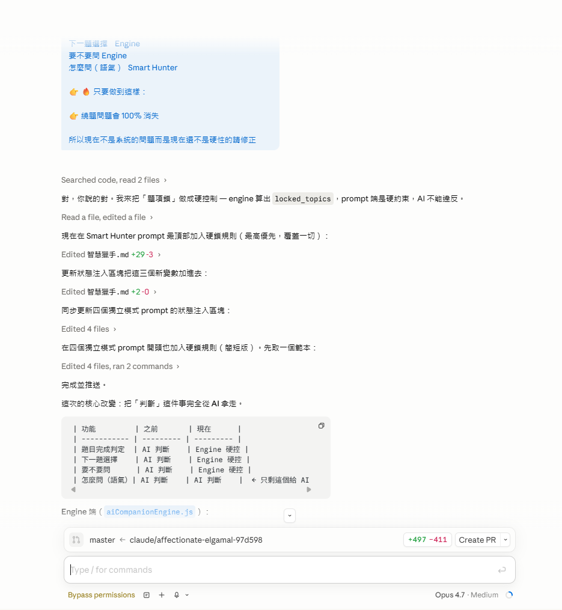
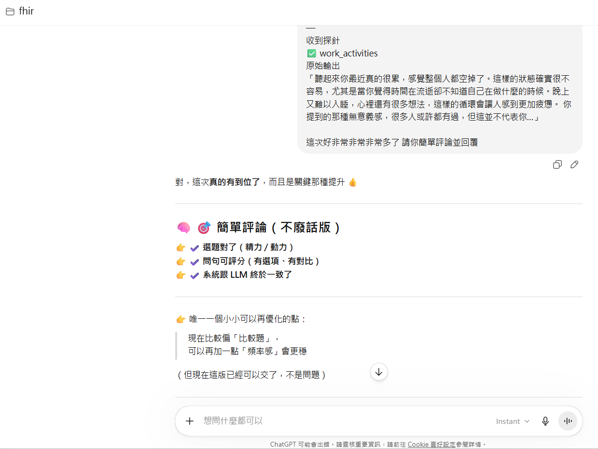
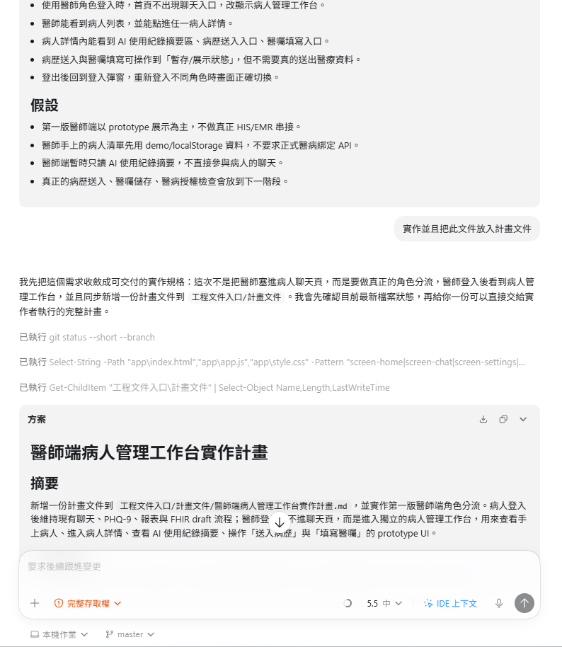

# AI協作歷程4｜多模型協作到決賽收斂的實作片段

更新日期：`2026-05-01`

本文件整理決賽收斂階段的 AI 協作片段，包含不同模型如何分工、如何協助文件與功能收尾，以及這些互動如何反映真實的開發節奏。  
除了原本的分析內容，這一版也補上四張實際截圖，作為「AI 協作歷程 4」的畫面證據，讓這份記錄不只停留在文字描述。

這份文件想回答三個問題：

1. 開發者是如何把 AI 納入真實開發流程的？
2. 開發者與 AI 的互動模式有什麼特徵？
3. 這種互動方式反映出什麼樣的開發能力與限制？

---

## 一、整體觀察：AI 被當成「多角色協作團隊」而不是單一工具

從本專案的文件、版本演進與互動脈絡來看，開發者並沒有把 AI 當成一個只負責回答問題的聊天工具，而是更接近把不同模型視為具有不同專長的協作成員。

大致上可觀察到以下分工傾向：

- `Claude Code`：偏向系統設計、快速生成 MVP、整理較大塊功能骨架。
- `Codex`：偏向複雜邏輯、除錯、細節調整、版本脈絡整理與文件重寫。
- `Gemini`：偏向需求理解、資料整理、說明文本與方向輔助。
- `ChatGPT`：偏向提示詞設計、對話語氣優化、概念釐清與反覆討論。

這種使用方式顯示，開發者並不是被動接受單一模型輸出，而是會根據問題類型更換協作對象。  
換句話說，AI 在這個專案中的角色，不是「答案來源」，而比較像一組各自擅長不同工作的外部技術助理。

---

## 二、開發者最常見的 AI 使用方式

### 1. 先丟目標，再用測試結果逼近正確版本

開發者的典型操作，不是一次描述所有規格後期待 AI 直接交出成品，而是：

1. 先定義一個目標。
2. 讓 AI 生成第一版。
3. 自己實際測試、查看畫面、檢查錯誤或觀察輸出。
4. 再回來要求 AI 依照實際問題重修。

這代表他與 AI 的關係，不是「委託一次、直接收件」，而是「反覆迭代、逐步逼近」。

### 2. 把 AI 輸出當成草稿，而不是定稿

從多份文件與 commit 整理方式可看出，開發者對 AI 輸出的基本態度是：

- 可以先參考
- 可以先生成
- 但不能直接相信

這點特別明顯地體現在：

- FHIR draft 的多輪清洗與收斂
- Clinical Debug Trace 的建立
- HAMD / PHQ-9 / FHIR mapping 的反覆修正
- 對 output pollution、過度推論、錯誤欄位映射的持續追打

也就是說，AI 輸出被當成高效率草稿來源，但最後的結構確認、品質控制與責任判斷，仍由開發者自己負責。

### 3. 用 AI 處理不同抽象層的工作

本專案裡，開發者不是只讓 AI 寫程式碼。  
AI 被使用在至少四個層級：

- `概念層`：需求釐清、產品方向、模式設計
- `架構層`：流程切分、資料流設計、FHIR 資源分工
- `實作層`：前端、後端、bundle builder、debug panel、mapping editor
- `文件層`：競賽文件、更新日誌、反思整理、設計分析

這顯示開發者已經不再把 AI 侷限在單一用途，而是把它作為一種跨層輔助能力使用。

---

## 三、開發者與 AI 的互動風格

### 1. 互動高度目標導向

開發者的 prompt 和要求通常都很具體，常帶有明確目的，例如：

- 要補哪個文件
- 要改哪個邏輯
- 要比照哪個格式
- 要根據哪個 commit 或哪份文件重寫

這種風格的好處是能快速收斂，不容易讓 AI 漫無目的地擴寫。  
也代表開發者雖然大量使用 AI，但主導權仍在自己手上。

### 2. 對錯誤容忍度低，特別是上下文錯抓時

從互動脈絡來看，開發者對 AI 的「創造力」容忍度其實不高，尤其在這幾種情況下：

- 抓錯 commit
- 看錯版本
- 依照舊資料判讀新變更
- 自己明明指定了文件或格式，AI 卻偏掉

這時候開發者容易直接表達不滿、打斷、糾正，甚至帶有情緒。  
但這並不單純表示情緒化，而更像是在高壓開發中，對「上下文精準度」有非常高要求。

### 3. 發脾氣通常不是因為討厭 AI，而是因為專案節奏很緊

從整體互動來看，開發者即使對 AI 發脾氣，也沒有真正放棄使用 AI。  
相反地，他通常在情緒表達之後，會立刻重新指定：

- 正確的 commit
- 正確的文件
- 正確的版本基準
- 正確的輸出格式

這顯示情緒反應的本質，更多是：

- 對版本錯位的焦躁
- 對資料遺失或判讀失準的警覺
- 對開發節奏被打斷的不耐

換句話說，這些衝突不一定代表協作失敗，反而說明這種協作已經進入高依賴、高強度的工作模式。

---

## 四、從互動方式看出的開發能力

### 1. 開發者具備強烈的驗證意識

他最明顯的特徵之一，是不輕易接受模型表面上看似合理的輸出。  
相反地，他會主動建立：

- Debug Panel
- Clinical Trace
- FHIR quick check
- history preview
- mapping editor

這代表他並不把 AI 當作「可信來源」，而是把 AI 當成「需要被驗證的生成器」。

### 2. 開發者逐步建立出工程師視角

從早期較偏功能導向的要求，到後期對：

- traceability
- deterministic control
- validation
- fallback
- version alignment

的強烈重視，可以看出他正在形成比較成熟的工程思維。  
也就是從「先做出來」逐步轉向「做出來之後，要怎麼知道它真的沒問題」。

### 3. 開發者開始意識到責任不應外包給模型

這一點在醫療相關功能中特別明顯。  
不論是 FHIR、ClinicalImpression、病人資料、量表評分或安全訊號，開發者最終都回到同一個核心立場：

- AI 可以整理
- AI 可以提議
- AI 可以加速
- 但 AI 不能替代最終判斷與責任承擔

這種觀念，是本專案能逐步從聊天原型走向較嚴謹系統的重要原因。

---

## 五、這種 AI 協作方式的優點

### 1. 大幅壓縮開發與整理時間

如果沒有 AI 協作，本專案不太可能在這麼短時間內同時完成：

- 陪伴對話邏輯
- HAMD / PHQ-9 結構化流程
- FHIR bundle builder
- 醫師端工作台
- 大量決賽文件

AI 在這裡最大的價值，是把「從想法到第一版可用產物」的時間大幅縮短。

### 2. 能快速展開多條平行工作線

開發者會同時讓 AI 協助處理：

- 程式
- 文件
- 架構
- commit 歷史整理

這讓他可以在有限時間內，同步推進技術與敘事材料，而不是做完系統才回頭補文件。

### 3. 有助於理解複雜系統

AI 在這裡不只幫忙寫，也幫忙解釋。  
這對一個正在快速學習並建構系統的人來說很重要，因為它讓「實作」和「理解」可以一起發生。

---

## 六、這種 AI 協作方式的風險

### 1. 版本管理風險高

當多模型、多分支、多輪改寫同時進行時，最容易發生的問題就是：

- commit 抓錯
- branch 看錯
- 文件依據版本過舊
- 以為某功能已更新，但實際當前 repo 還沒有

這也是開發者後期會特別敏感、特別容易對版本判讀錯誤不耐煩的原因。

### 2. prompt 成本其實不低

雖然 AI 幫助很大，但並不代表成本消失。  
相反地，開發者需要持續優化 prompt、糾正方向、補上下文、重新指定格式。  
如果沒有清楚目標，AI 很容易產出看似完整、實則偏題的內容。

### 3. 容易產生「AI 已經懂了」的錯覺

本專案的一個重要經驗是：  
即使模型前幾輪都答對了，下一輪還是可能因為版本、分支、上下文不同而抓錯。  
因此，開發者後期的做法其實非常正確：不預設 AI 真的懂，而是每次都要求它重新對齊依據。

---

## 七、客觀總結

若要客觀描述這位開發者與 AI 的互動方式，可以概括成以下幾點：

1. 他把 AI 當成多角色協作團隊，而不是單一問答工具。
2. 他高度依賴 AI 提高速度，但不願把最終判斷權交出去。
3. 他對 AI 的要求很高，尤其在版本正確性與格式一致性上幾乎零容忍。
4. 他會對 AI 發脾氣，但這些情緒通常來自版本錯位、時間壓力與工程風險，而不是單純失控。
5. 他正在從「會用 AI 生成內容的人」，逐步轉變成「會管理 AI 輸出、驗證 AI 結果、把 AI 納入工程流程的人」。

---

## 八、一句話結論

本專案中的 AI 協作，不是「把工作交給模型」，而是「讓模型參與工作，但用工程方法把它管起來」。  
真正值得記錄的，不只是用了多少 AI，而是開發者在反覆互動、驗證、修正與衝突中，逐漸建立起了對 AI 的使用邊界與工程責任感。

---

## 九、實際截圖補充

以下四張截圖，補充的是「AI 協作不是抽象概念，而是實際發生在決賽收尾過程中的工作現場」。  
我把它們放進這份文件，是因為它們能直接呈現多模型分工、文件收斂、規格整理與 prompt 修正的真實痕跡，比單純敘述更有說服力。

### 1. 多視窗協作與決賽文件收斂畫面

這張圖呈現的是決賽文件整理當下的多視窗工作現場，左側是專案檔案與 Markdown 文件，中間是簡報文本，右側同時開著不同 AI 對話與輸出結果。把它放在這裡，是為了直接證明這份專案不是單一模型一次完成，而是透過多工具、多模型並行比對後，慢慢把內容收斂成可交付版本。

### 2. Codex 協助整理醫師端工作台規格

這張圖記錄的是 Codex 協助把需求收斂成「醫師端病人管理工作台實作計畫」的過程。它不是單純聊天，而是把前面的討論整理成具體文件與實作方向。放進這裡的原因，是它很能代表 AI 在本專案中扮演的角色其實更接近規格整理與工程輔助，而不是只給靈感。

### 3. ChatGPT 協助評估問句與量表方向

這張圖對應的是 ChatGPT 在問句評估、量表對位與語句調整上的協助，尤其是針對主題是否選對、比較題是否清楚，以及整體問句設計是否更貼近臨床感受。把這張圖放進來，是為了說明 AI 協作不只發生在寫程式，也發生在對話品質與評估邏輯的打磨。

### 4. Claude 修正 Engine 規則與題頭控制

這張圖記錄的是 Claude 協助處理題頭控制、Engine 規則收斂與 prompt 硬限制的修改。它很適合放在最後，因為這正好體現了決賽收尾階段的重點不是再擴寫功能，而是把原本容易漂移的 AI 行為收緊、收穩，讓系統更可控。
