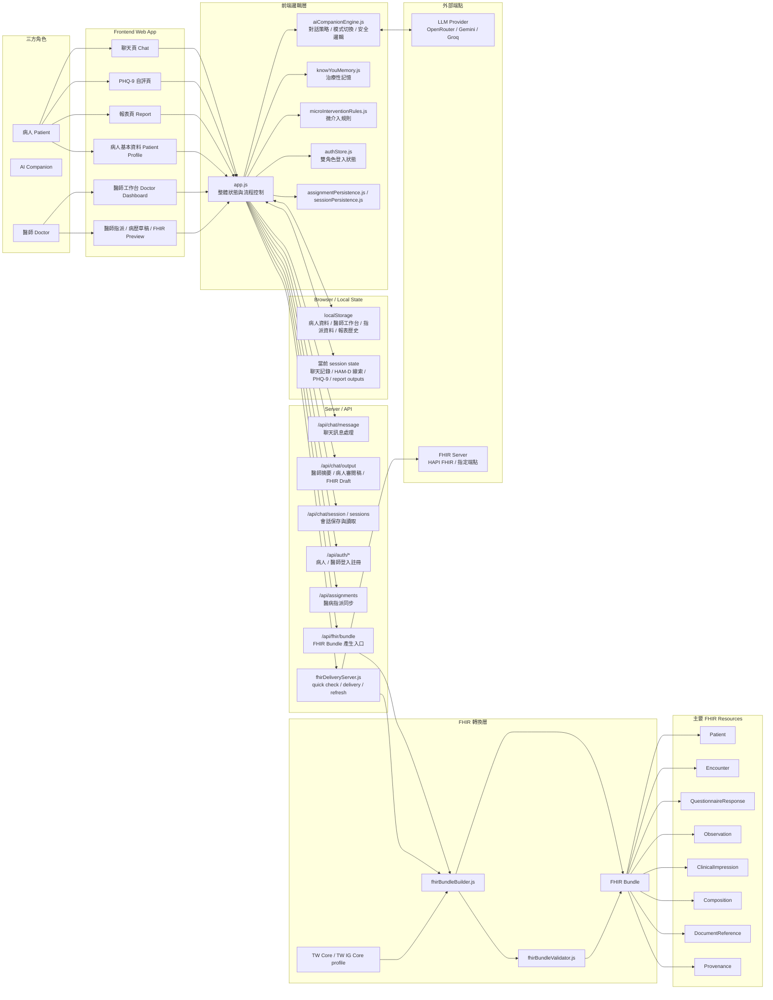
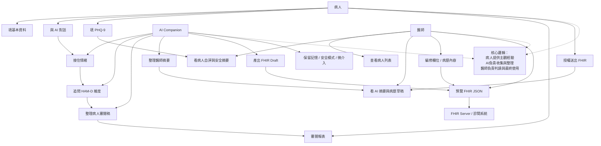
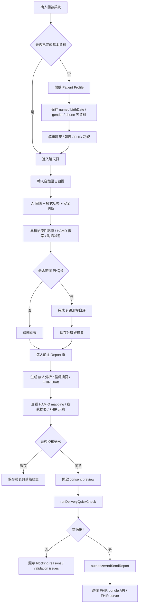
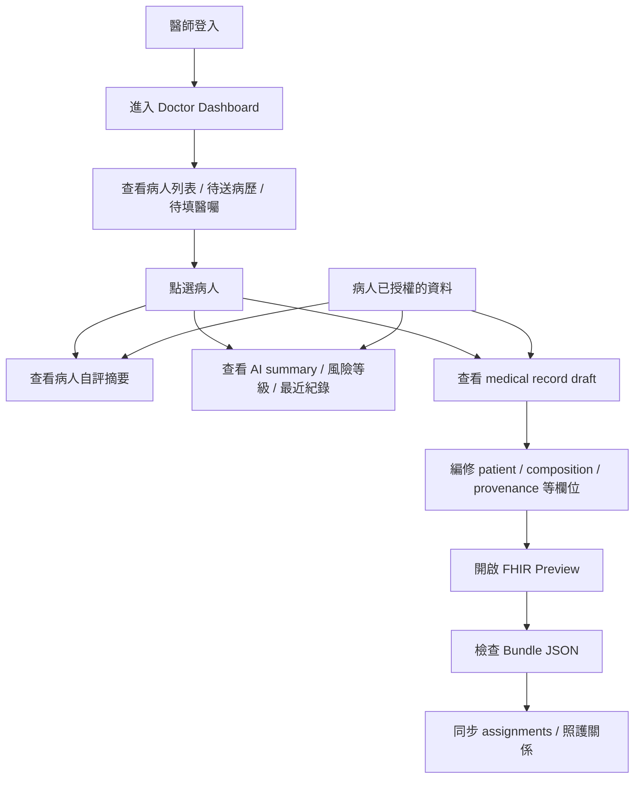
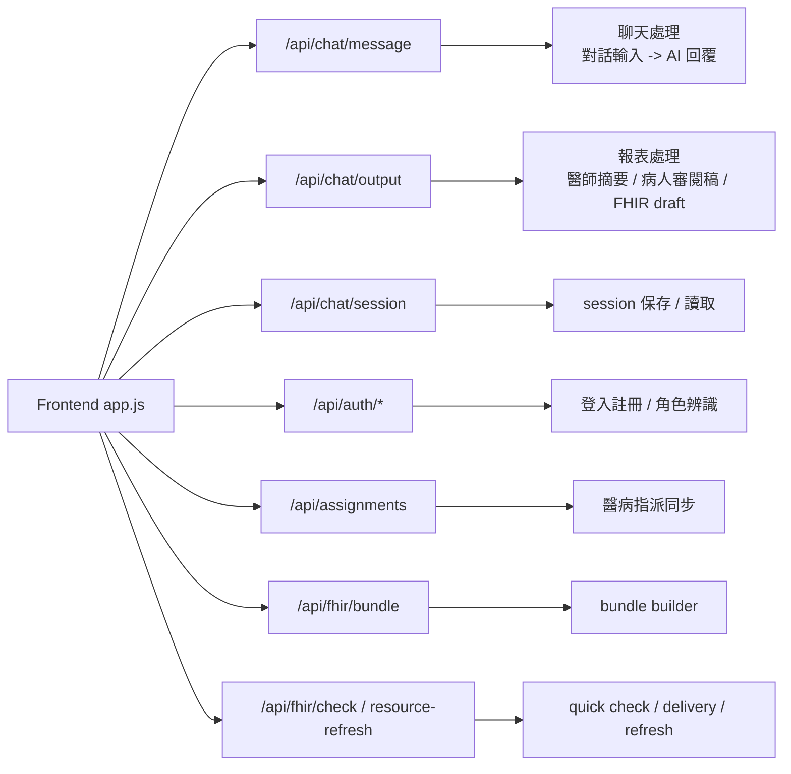
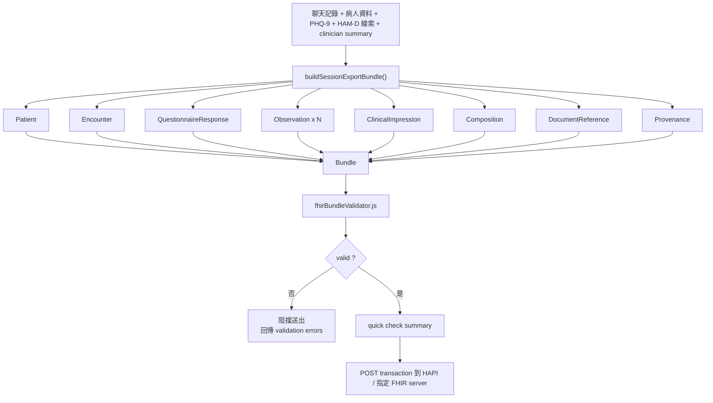
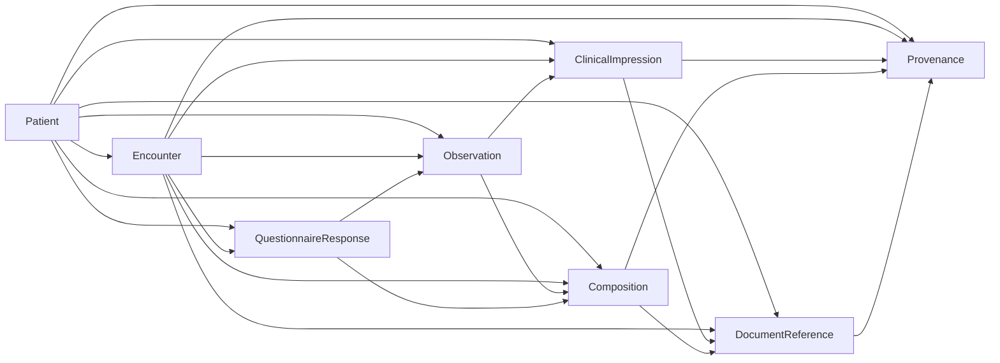

# Rou Rou AI Companion 系統全景地圖（Mermaid 版）

更新日期：`2026-05-01`

這份文件的目的不是列所有函式，而是用工程視角把整套系統的「人、畫面、資料、FHIR、server」一次攤開，讓人能看懂這個專案到底怎麼運作。

## 1. 系統全景總覽



## 2. 三方角色在系統上的交通



## 3. 病人端主流程



## 4. 醫師端主流程



## 5. 後端與 API 分工



## 6. FHIR 交付管線



## 7. FHIR Resource 之間怎麼串



## 8. 這套系統真正的核心不是聊天，而是「分工」

1. 病人不是直接寫病歷，而是先用自然語言與量表把主觀感受交出來。
2. AI 不是直接做診斷，而是做整理、追問、映射、摘要與 FHIR 草稿生成。
3. 醫師不是看整段原始聊天，而是看被整理過、較可判讀的資訊。
4. FHIR 不是裝飾，而是把這段互動變成可驗證、可交換、可交付的結構化資料。
5. Server 的角色不是只存資料，而是擋錯、驗證、quick check、再決定能不能送。

## 9. 一句話版本

```text
病人提供經驗 -> AI 把經驗整理成可評估訊號 -> 醫師接收可用摘要 -> 系統把這段交接封裝成 FHIR Bundle 並送往 server。
```
