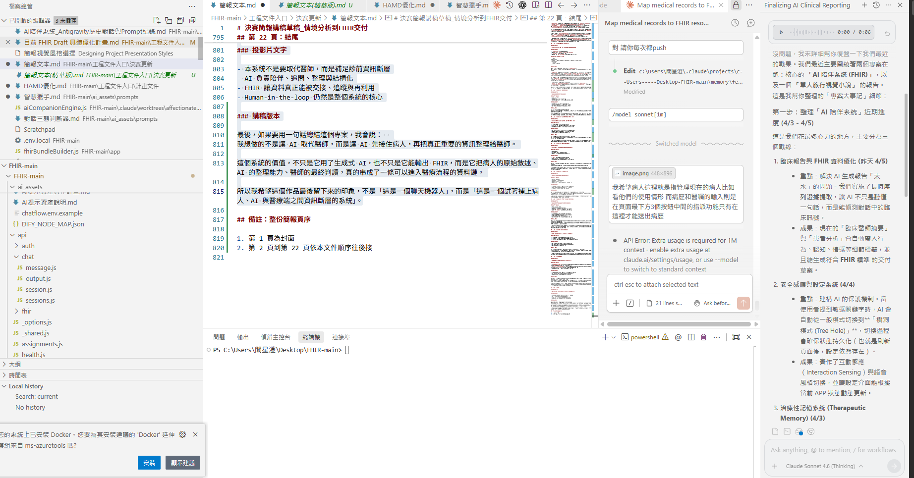

# 導師互動與實作對照｜輕量版
更新日期：`2026-05-01`
用途：給簡報、答辯、反思快速使用的短版，保留 `問題 / 結論 / 實作 / commit`，聚焦在導師互動之後，哪些想法真的被你做進系統。

## 截圖補充

### 1. 導師互動與問題收斂畫面

這張圖對應的是你和導師直接討論「非診間資料填寫」「補充主觀描述 vs 結構化欄位」「醫師實際操作負擔」的過程。它很適合放在輕量版前面，因為這份短版本來就是要快速證明：你不是憑空想像需求，而是有從導師互動裡面抓出可落地的實作方向。

### 2. 完整版整理與實作收斂畫面

這張圖補的是後續整理現場，能直接看到你怎麼把討論內容收斂成文件結構、實作重點與簡報文字。把它一起放進輕量版，是為了讓評審一眼看出：這不是聊天截圖而已，而是有被你轉成具體設計與交付內容。

## 1. 資料分類：Observation / Condition
問題：
- AI 整理內容不能直接當正式診斷。
- 病人原話、AI 推論、醫師判讀需要分層。
結論：
- AI 推論優先放 `Observation`。
- 長期或反覆問題才整理成 `Condition` 概念。
- AI 是 `signal`，醫師才是 `judgment`。
實作：
- 導入 `AI symptom bridge`，改成證據軌 + 推論軌。
- 清除操作句、快捷指令、模式控制語句。
- 把 `Observation` 調整成可讀臨床摘要句。
- 把 `ClinicalImpression` 與 `Observation` 分開補強。
commits：`bd9727f` `664274a` `4e7e6b9` `f581b3a` `e197c47`

## 2. Encounter 使用邏輯
問題：
- AI 聊天不一定等於正式醫療接觸。
結論：
- 一般陪伴聊天不必強行做成 `Encounter`。
- 接近診前整理或照護接觸時，再使用 `Encounter`。
實作：
- 修正 `Encounter` 的 status、period、serviceType。
- 強化的是交付品質，不是把所有聊天都醫療化。
commits：`38b70e4` `3de87ee` `69d1e57`

## 3. 病人參與與 QuestionnaireResponse
問題：
- AI 草稿若沒有病人確認，容易失真。
- 病人自評若沒進系統，只會停在聊天層。
結論：
- 最佳流程是 `AI draft -> 病人確認 -> 醫師使用`。
- 病人不只是資料來源，也是資料確認者。
實作：
- 新增 PHQ-9 雙軌流程。
- 把病人 profile intake 接進 FHIR draft。
- 清洗 `QuestionnaireResponse` recent evidence。
- 讓醫師端可看到病人自評摘要。
commits：`c24ebb4` `925cd04` `3de87ee` `28d2f35` `01ccc40`

## 4. 醫師使用習慣與責任分工
問題：
- 醫師不會想看一大坨聊天逐字稿。
- AI 可以輔助，但不能接管醫師責任。
結論：
- 醫師偏好結構化資料與低操作量。
- AI 負責整理，醫師負責判讀。
實作：
- 建立雙角色登入系統。
- 新增醫師端工作台、病人列表、詳情區、醫囑表單。
- 顯示病人自評與安全摘要給醫師看。
commits：`cd9a4fa` `dbed020` `a7f3ac2` `92de393` `d86d1e2`

## 5. 非診間互動與不可忽略的訊息
問題：
- 病人資料若有回傳，卻沒被看見，會產生照護風險。
結論：
- 系統不能只會收資料，還要保證重要資料不會消失。
實作：
- 保存 assignment、report、PHQ9 state、FHIR history。
- 讓 doctor assignment tab 能穩定刷新與保留狀態。
commits：`6a8f0f7` `cb71f3d` `2f0f19b` `6260575` `3bed992`

## 6. 判讀責任與 AI 法律邊界
問題：
- AI 可以參與整理，但不能假裝自己是最後判讀者。
結論：
- 責任關鍵在「誰最後採用與判讀」。
- 系統要把 AI 設計成整理者、提醒者、輔助者。
實作：
- `ClinicalImpression` 採保守描述與 `preliminary` 狀態。
- 建立 Clinical Debug Trace 與 decision source 可視化。
commits：`e197c47` `497f94c` `2632198` `1a4402a`

## 7. FHIR PoC 實作策略
問題：
- 比賽階段若一開始就追完整合規，成本太高。
結論：
- PoC 階段先重視資料流合理、resource 使用正確、角色分工清楚。
- 不必先把全部時間投入完整 TW Core compliance。
實作：
- 對齊 FHIR draft、bundle builder、validator、sample output。
- 新增 quick check 與 delivery gating。
commits：`92276d0` `1905704` `6f54f2c` `8c79630` `baf56f1`

## 8. 最後總結
推薦資料流：
`AI 對話 -> QuestionnaireResponse -> Observation -> Condition / ClinicalImpression -> 醫師判讀`
角色分工：
- AI：收集、整理、補結構
- 病人：回答、補充、確認
- 醫師：判斷、修正、負責
一句話總結：
`這個專案的核心，不只是把 AI 接上 FHIR，而是把 AI、病人、醫師三者在資料與責任上的位置分清楚。`
