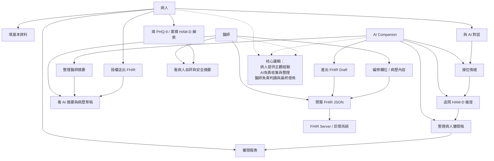
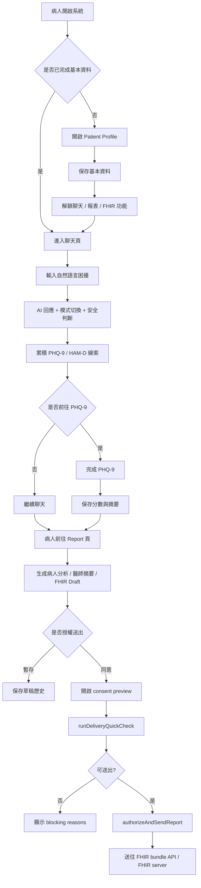
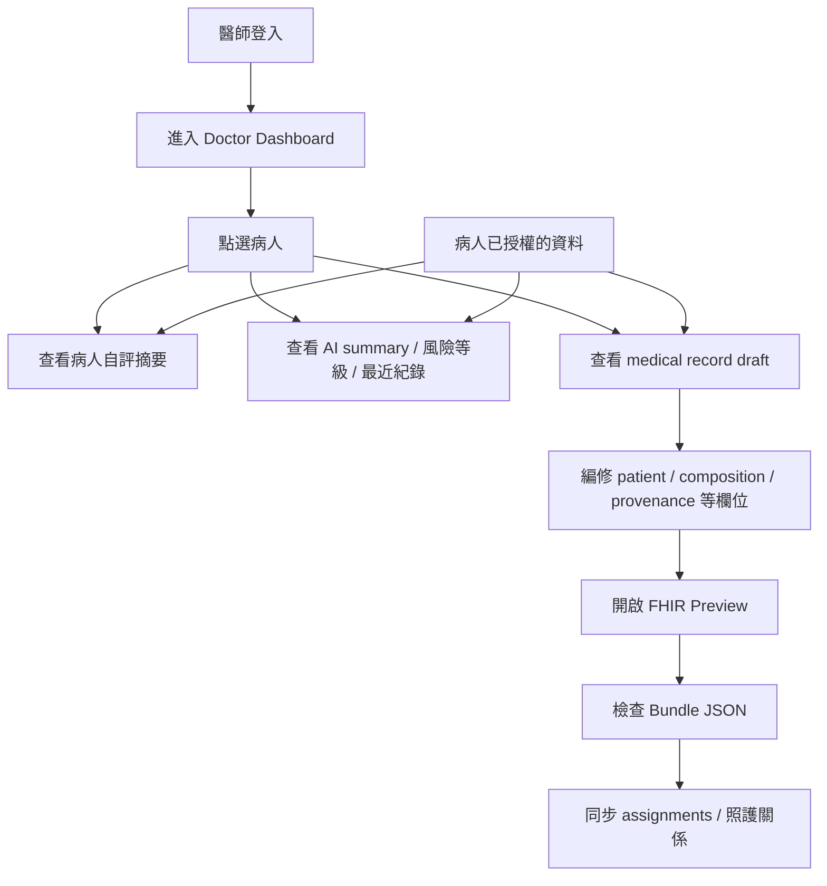
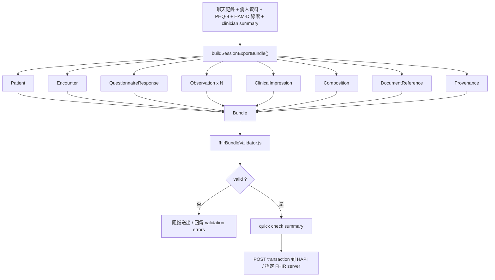
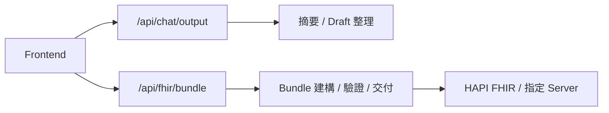
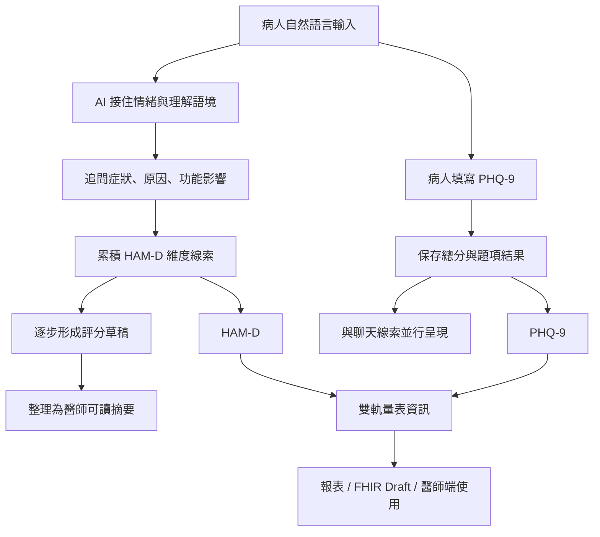

# 決賽簡報講稿草稿_情境分析到FHIR交付

更新日期：`2026-05-01`

這份文件是給決賽簡報直接使用的講稿草稿版本，內容從前段的情境與使用者分析，一路延伸到後段的系統流程與 FHIR 交付。

前半段對應簡報第 `1` 到第 `3` 頁，後半段對應簡報第 `4` 到第 `8` 頁。

每一頁都包含：

1. 投影片標題
2. 投影片上建議放的精簡文字
3. 你報告時可直接延伸的講稿

## 開場草稿

如果你要從上一個段落自然轉進這一部分，我建議可以先用這段開場：

`接下來，我想先說明這個系統為什麼成立。`
`我認為這個題目最關鍵的，不只是心理健康需求本身，而是 AI 為什麼特別適合放進這個場景。`
`因為心理健康不是單純填量表就能完成的事情，它裡面有大量情緒、語意、背景與脈絡，而這些剛好是現在生成式 AI 最有機會承接的部分。`
`所以這三頁我想講三件事：第一，為什麼 AI 特別適合心理健康；第二，為什麼不能只靠量表；第三，我這個系統最後為什麼會收斂成病人、心理專業與 FHIR 工程之間的橋樑。`

如果你想要更短、更像答辯現場直接切進去，也可以用這版：

`接下來我想回答一個問題，就是為什麼這個題目一定要用 AI 來做。`
`我認為心理健康最困難的地方，不是有沒有量表，而是病人能不能把真正重要的東西說清楚。`
`而我這個系統的設計，就是想讓 AI 先接住這些原始敘述，再把它整理成醫師真正用得上的資料。`

## 第 1 頁：為什麼 AI 特別適合心理健康場景

### 投影片標題

`AI 特別適合承接心理健康中的前段互動與整理工作`

### 投影片文字

- 能長時間、低壓力地陪伴使用者互動
- 能處理大量語意、情緒與背景脈絡
- 能先蒐集，再整理，再轉成可用資料
- 特別適合承接診前高耗能的前段工作
- 心理健康需求持續擴大，傳統單次量表難承接日常波動

### 講稿版本

如果今天只是一般醫療資料輸入，其實不一定需要 AI。  
但心理健康這個場景不太一樣，因為它裡面有大量敘述性、情緒性、脈絡性的內容，不是只靠幾個欄位就能填完。

我認為 AI 特別適合這個場景的原因，在於它可以長時間、低壓力地和使用者互動。使用者不需要在短短幾分鐘內一次講清楚自己，也不需要承受立即被判斷的壓力，而是可以先慢慢把情緒、症狀、生活背景和脈絡說出來。

更重要的是，AI 不是只把話記下來，它還能處理語意、情緒和上下文之間的關係。也就是說，它不只是收集，而是能先做初步理解與整理，這對心理健康場景非常關鍵。

這一點其實也和外部研究觀察一致。無論是 WHO、OECD 對心理健康需求與系統缺口的描述，還是 EMA 對於即時、連續資料收集價值的強調，都在說明一件事：心理健康問題不是靠一次填表就能完整理解的，它更需要能承接日常波動的互動方式。

所以對我來說，AI 在這裡最有價值的地方，不是取代專業，而是承接那些原本很耗時間、很需要耐心、但醫療現場最難負擔的前段互動工作。

## 第 2 頁：為什麼是 AI，而不是只有量表或問卷

### 投影片標題

`真正困難的不是量化症狀，而是理解症狀背後的原因與脈絡`

### 投影片文字

- 症狀可量化，但背景與原因需要時間理解
- 診間時間有限，病人常無法完整表達
- 單次量表難承接日常生活中的連續變化
- AI 可先蒐集敘述，再整理成可交接資訊
- Woebot / Wysa / EMA 都支持連續互動式資料收集的價值

### 講稿版本

我認為心理健康場景裡最難的事情，不是把症狀分數填出來，而是理解症狀背後的原因、觸發點、生活脈絡和功能影響。  
很多症狀其實可以量化，但真正對判讀有幫助的，往往是那些敘述性的背景資料。

但這正好是醫療現場最難負擔的一段。因為醫師時間有限，病人又常常在診間裡講得零散、片段，甚至因為緊張而漏掉真正重要的內容。傳統量表雖然有價值，但大多偏向單次填寫，比較難承接日常生活中的動態變化。

所以我會選擇 AI，不是因為它比專業人員更懂診斷，而是因為它可以在診前先用更低成本做前段蒐集與整理。病人先對 AI 講出來，AI 再把原始敘述整理成醫療端可用的資訊，這樣醫師才更容易快速進入重點。

這個方向其實也不是只有理念上的推論。像 Woebot 和 Wysa 的研究，都顯示對話式 AI 至少能成為一個有效的前段互動介面；而 EMA 相關方法則指出，與其依賴事後回憶，不如在真實生活情境中持續收集資料，這樣更能接近心理狀態的實際波動。

也因為這樣，AI 的價值不是停在聊天，而是停在「聊天之後能不能整理出可交接的資料」。這才是它在心理健康市場真正適合的原因。

## 第 3 頁：我的產品定位是什麼

### 投影片標題

`AI 串起諮商心理、臨床心理與 FHIR 工程，成為病人到醫師之間的橋樑`

### 投影片文字

- 靈感來自 `ChatGPT-4o` 的語意理解與陪伴能力
- 諮商心理重視陪伴與關係建立
- 臨床心理重視評估、症狀辨識與判讀
- FHIR 工程負責結構化、標準化與可交換性
- AI 將三者串起來，但不取代醫師判斷
- FHIR 讓整理結果不只是摘要，而是可交換、可追蹤的醫療資料
- 同時必須限制 AI 過激行為，強化安全邊界

### 講稿版本

我自己的開發動機，其實很大一部分來自 ChatGPT-4o 的問世。  
它讓我第一次很強烈地感受到，AI 已經不只是回答問題，而是真的能在複雜語意情境裡做分析、解釋、安慰與延伸追問。

但我也發現，大家常常只看到它「很會安慰人」，卻忽略它背後其實同時包含了大量心理學知識、語境理解與對話能力。這讓我開始思考，如果把這種能力放進更受控制、更貼近醫療流程的系統裡，它是不是可以成為一個真正有用的橋樑。

我後來慢慢意識到，這個題目其實剛好卡在三種能力的交界。  
第一個是諮商心理，它更重視陪伴、理解、關係建立，讓使用者願意說。第二個是臨床心理，它更在意評估、症狀辨識與判讀，讓資訊有臨床意義。第三個則是 FHIR 工程，它要求資料最終能被結構化、標準化，並且真的可以被系統使用。

一般情況下，很少會有單一角色同時熟悉這三件事。心理師未必熟悉 FHIR，FHIR 工程師也未必理解心理互動裡那些微妙的溝通與判讀差異。但 AI 剛好可以站在中間，把原始對話先接住，再往兩端整理。

所以我對這個系統的定位非常明確。AI 不取代醫師診斷，它負責的是陪伴、追問、整理、映射；醫師真正負責的，仍然是判讀、確認與最終決策。這樣的設計，才有機會讓病人更敢說，醫師更快看到重點，而資料最後又能直接進入 FHIR 結構。

而 FHIR 在這裡的重要性，不只是因為它是一個競賽要求或標準格式，而是因為它會逼系統進一步思考：哪些內容應該成為 Observation，哪些應保留在 QuestionnaireResponse，哪些適合放進 Composition。也就是說，FHIR 讓 AI 整理出的內容不只是摘要，而是能被醫療系統交換、追蹤、再利用的資料。

但同時，我也很在意安全問題。生成式 AI 在心理健康場景若沒有被控制，可能會讓使用者過度依賴，甚至在脆弱狀態下受到錯誤引導。所以本系統不只追求互動自然，也非常重視對話控制、安全模式與 Human-in-the-loop。我要做的不是一個情緒化的聊天機器，而是一個安全、可控、能夠輔助醫療流程的 AI 工具。

## 三頁的總結建議

如果你要把這三頁接起來，整段節奏可以是：

1. `先講為什麼是 AI`
   因為心理健康最需要的不是回答，而是理解、陪伴與整理。
2. `再講為什麼不只靠量表`
   因為真正有價值的是症狀背後的原因、背景與脈絡。
3. `最後講你的定位`
   你不是做 AI 心理師，而是在做心理專業與 FHIR 工程之間的橋樑。

## 最後一句收束

你在這個部分最後可以用這句收尾：

`我想做的不是讓 AI 取代醫師，而是讓 AI 先接住病人，再把真正重要的資訊整理給醫師。`

## 第 4 頁：三方角色在系統上的交通

### 投影片標題

`三方角色在系統上的交通`

### Mermaid 圖



### 投影片文字

這一頁建議只放圖，不另外放文字。

### 講稿版本

這一頁我想先用一張完整但已經收斂過的角色交通圖，說明病人、AI 與醫師之間到底怎麼互動。  
病人會先完成基本資料、和 AI 對話、填寫 PHQ-9、審閱報表，最後決定是否授權送出。AI 位於中間，負責接住情緒、追問 HAM-D 維度、整理病人審閱稿、生成醫師摘要與 FHIR Draft。醫師端則是在病人授權後，查看病人自評、安全摘要、AI 整理出的草稿，再做最後判讀與使用。

所以這張圖的重點是，這不是單向聊天，而是一個病人、AI、醫師三方之間的資料交接流程。

## 第 5 頁：系統主流程

### 投影片標題

`從病人對話到醫師可用資訊的主流程`

### 簡化 Mermaid


### 投影片文字

- 病人以自然語言輸入內容
- AI 逐步追問並整理重要資訊
- 系統累積 PHQ-9 與 HAM-D 線索
- 生成報表、摘要與 FHIR Draft
- 經授權後交付醫療端使用

### 講稿版本

在流程上，病人一開始不是直接面對量表，而是先透過自然語言和系統互動。  
AI 會先做陪伴式回應，再根據內容逐步追問、整理，慢慢累積和症狀、情緒、壓力來源以及功能影響相關的資訊。這個過程中，系統不只承接 PHQ-9，也會逐步整理出 HAM-D 相關線索。

接著，系統會把這些內容整理成不同層次的結果，例如病人可閱讀的內容、醫師摘要，以及更結構化的 FHIR Draft。病人在確認與授權之後，這些資料才會被交付到醫療端使用。

所以這個流程不是聊天完就結束，而是從對話開始，一路走到醫師可以真正使用的資訊。

### 延伸版 Mermaid



## 第 6 頁：醫師端流程

### 投影片標題

`醫師端查看與使用流程`

### Mermaid 圖



### 投影片文字

- 醫師端不看完整原始對話，而是看整理後的重點
- 可查看病人自評、安全摘要與 AI 產出的草稿
- 可進一步編修欄位，並預覽 FHIR JSON
- 最後再同步到醫療端使用流程

### 講稿版本

醫師端的流程和病人端不同，它的重點不是蒐集原始內容，而是快速進入整理後的重點。  
醫師登入後，會直接進入 Dashboard，點選病人後，可以查看病人自評摘要、AI summary、風險等級，以及已整理好的 medical record draft。

在這個階段，醫師不是從零開始，而是在 AI 已經整理好的基礎上再做確認與編修。醫師可以進一步調整 patient、composition、provenance 等欄位，然後打開 FHIR Preview 檢查 JSON 結果。

所以這張圖想呈現的是：醫師端不是另一個聊天介面，而是一個接收、判讀與確認資料的工作台。

## 第 7 頁：FHIR 交付管線

### 投影片標題

`FHIR 交付管線：從對話資料到可送出的醫療 Bundle`

### Mermaid 圖



### 投影片文字

- 對話資料不直接送出，而是先轉成多個 FHIR resources
- `buildSessionExportBundle()` 組成完整 Bundle
- `fhirBundleValidator.js` 先做驗證與 quick check
- 驗證通過後，才經由 API 送往 HAPI / 指定 FHIR server

### 講稿版本

這一頁我想特別聚焦在 FHIR 交付本身，因為這也是這個專案和一般 AI 陪聊工具最不一樣的地方。  
系統不會把聊天內容原封不動送出去，而是先把聊天記錄、病人資料、PHQ-9、HAM-D 線索，以及 clinician summary，整理成一組可被映射的輸入。

接著，系統會透過 `buildSessionExportBundle()` 把這些內容拆成多個 FHIR resources，例如 Patient、Encounter、QuestionnaireResponse、Observation、ClinicalImpression、Composition、DocumentReference 和 Provenance，最後再組成一個完整 Bundle。

但 Bundle 生成之後不會直接送出，還要先經過 `fhirBundleValidator.js` 驗證，確認資料結構是否合理，並透過 quick check 判斷目前是否可交付。如果驗證失敗，系統就會阻擋送出，並回傳 validation errors；只有通過之後，才會經由 API 用 transaction 的方式送到 HAPI FHIR 或指定的 FHIR server。

API 在這裡扮演的是交付閘門的角色。也就是說，它不是只幫忙傳資料，而是把授權、驗證、交付這幾件事串起來，確保最後送到醫療端的，不是單純摘要，而是一份真的可交換、可追蹤、可再利用的 FHIR Bundle。

### API 補充 Mermaid



### API 補充說明

- `/api/chat/output`：負責整理醫師摘要、病人審閱稿與 FHIR Draft 基礎輸出
- `/api/fhir/bundle`：負責 Bundle 建構、驗證與正式交付流程
- API 的角色不是只傳資料，而是負責把整理、驗證、授權、交付串成一條完整管線

## 第 8 頁：FHIR 在本系統中的功能

### 投影片標題

`FHIR 在這個系統中的角色，不只是格式，而是資料交接能力`

### 投影片文字

- FHIR 讓 AI 整理結果不只是摘要，而是可交換、可追蹤的醫療資料
- 系統必須判斷哪些內容屬於 `Observation`
- 哪些內容保留在 `QuestionnaireResponse` 或 `Composition`
- 這使 AI 輸出能真正進入醫療端，而不只是停留在聊天紀錄

### 講稿版本

這一頁我想特別說明，FHIR 在這個系統裡的角色到底是什麼。  
它不是單純把聊天內容換成另一種 JSON 格式，也不是為了比賽硬套上一層標準，而是讓 AI 整理出的內容，真的具有醫療資料交接能力。

如果今天只是一般 AI 陪聊工具，它最多做到的是把對話整理成一段摘要，或讓使用者覺得被理解。但在這個系統裡，我希望最後留下來的不只是陪伴感，而是能夠進一步被醫療端交換、追蹤、再利用的資料。

也因此，FHIR 會逼系統多做一步思考。哪些內容應該被整理成 Observation，哪些屬於病人的原始敘述，應保留在 QuestionnaireResponse，哪些又更適合放在 Composition 裡作為交接摘要。這代表系統不是把資料一股腦塞進去，而是必須先理解資料性質，再決定如何映射。

這也是這個專案和一般 AI 陪聊工具最大的差異。一般 AI 陪聊大多停在互動本身，而這個系統的目標是讓互動最後能夠被醫療流程接住。換句話說，FHIR 在這裡的價值，不只是標準化，而是把 AI 的整理能力，轉成真正可進入醫療體系的資料能力。

### 可直接放簡報的小結

`一般 AI 陪聊停在對話；Rou Rou AI Companion 進一步把對話轉成可交換、可追蹤、可再利用的 FHIR 資料。`

## 第 9 頁：Version 1（初賽版本）

### 投影片標題

`Version 1：以 AI 陪伴與基本 FHIR 草稿為核心的初賽版本`

### 投影片文字

- 已具備 AI 陪伴式對話與多種互動模式
- 可累積治療性記憶與個人化理解
- 可產生病人分析、醫師摘要與 FHIR Draft 雛形
- 已建立 Patient / Encounter / Observation 等基本 FHIR 輸出能力
- 產品重心仍偏向「陪伴 + 展示原型」

### 講稿版本

如果把這個專案拆成兩個階段來看，那初賽版本，也就是大約四月八號以前，已經先完成了一個很重要的基礎。  
當時系統已經具備 AI 陪伴式對話能力，也有多種互動模式，能讓使用者在比較低壓力的情況下開始表達自己。

同時，系統也已經開始累積治療性記憶，能逐步記住使用者的壓力來源、情緒狀態與個人化脈絡。除了陪伴之外，當時也已經能夠產出病人分析、醫師摘要，以及 FHIR Draft 的基本雛形。

如果用一句話概括，Version 1 的價值在於：它先證明了這個題目可以成立，也就是 AI 不只可以陪伴，還能開始承接心理健康資訊並往 FHIR 草稿靠近。

但那時候的產品重心，還比較偏向「有陪伴感的 AI 原型」與「FHIR 展示雛形」，系統雖然已經能輸出資料，但臨床邏輯、流程控制與交付穩定性還沒有收斂到現在這麼完整。

## 第 10 頁：Version 2（決賽版本）

### 投影片標題

`Version 2：從 AI 陪伴原型，收斂成臨床整理與 FHIR 交付系統`

### 投影片文字

- 強化 HAM-D / PHQ-9 雙軌蒐集與評估邏輯
- 加入病人授權、醫師端工作台與交付流程
- FHIR resources 分工更明確，交付鏈更完整
- 對話控制、安全模式、驗證與 quick check 大幅補強
- 系統定位從「陪伴原型」收斂為「診前整理與輔助工具」

### 講稿版本

而從四月八號到五月一號之間，這個系統其實發生了很大的收斂。  
如果說 Version 1 證明了 AI 可以陪伴並開始整理資訊，那 Version 2 做的事情，就是把這個原型真正推向臨床整理與 FHIR 交付。

這段期間最大的變化之一，是系統開始更明確地整合 PHQ-9 與 HAM-D，不再只是聊天，而是把對話內容逐步收斂成可評估、可追蹤的症狀線索。另一個重要進展，是病人授權流程、醫師端工作台、FHIR 預覽與正式交付管線都逐漸成形，讓整個流程從病人端一路串到醫療端。

同時，FHIR resources 的分工也更清楚了，像 Observation、QuestionnaireResponse、Composition、Provenance 不再只是有輸出而已，而是開始有比較明確的角色定位。再加上 validator、quick check、安全模式、對話控制這些補強，系統從一個能展示的 AI 陪伴原型，慢慢變成一個更可控、更能進入醫療流程的輔助系統。

所以如果要總結這兩個版本的差異，我會說：
Version 1 比較像是「AI 陪伴 + FHIR 雛形」；
Version 2 則是「臨床整理 + 授權交付 + 可用的 FHIR 管線」。

## 第 11 頁：HAM-D 與 PHQ-9 的雙軌量表流程

### 投影片標題

`HAM-D 在聊天中逐步生成，PHQ-9 作為另一條並行量表軌道`

### Mermaid 圖



### 投影片文字

- `HAM-D` 不是直接填表，而是透過對話逐步累積線索
- AI 會追問症狀、原因、功能影響，形成可評估項目
- `PHQ-9` 則由病人直接完成，提供結構化自評分數
- 兩條量表軌道最後會一起進入報表、FHIR 與醫師端

### 講稿版本

這一頁我想特別說明，本系統裡最重要的一個設計，就是 HAM-D 和 PHQ-9 不是同一種收集方式，而是雙軌並行。  
PHQ-9 比較接近傳統量表，它由病人直接填寫，所以能很快得到結構化的分數與題項結果。

但 HAM-D 不一樣。HAM-D 在這個系統裡不是讓病人直接硬填，而是透過聊天一步步形成。病人先以自然語言描述自己的感受，AI 先接住情緒，再根據對話內容追問症狀、原因、生活背景與功能影響，慢慢累積到不同的 HAM-D 維度上。

也就是說，HAM-D 的價值在這裡不是一開始就拿到分數，而是讓 AI 透過對話去蒐集那些真正和臨床判讀有關的脈絡，再逐步形成評分草稿。這樣做的好處是，病人不需要一開始就面對一串生硬問題，而是能先在比較自然的互動裡，把資訊慢慢說出來。

最後，這兩條量表軌道會一起進入報表、FHIR Draft 和醫師端。PHQ-9 提供快速、結構化的自評結果；HAM-D 提供從聊天中累積而來、比較有脈絡的評估線索。這也是本系統和單純量表工具最大的不同：它不是只收分數，而是讓量表和對話互相支撐。

## 第 12 頁：FHIR 重要欄位結構（一）

### 投影片標題

`五個最重要的 FHIR resource，先從 Patient 與 QuestionnaireResponse 開始`

### 投影片文字

- `Patient`：承接病人身份與基本資料
- `QuestionnaireResponse`：承接病人原始作答與審閱流程
- `Patient` 重點是「這是誰」
- `QuestionnaireResponse` 重點是「病人原本怎麼回答」

### 可直接放簡報的格式示意

```text
Patient
- key / name / gender / birthDate
- identity_strategy / demographics_status

QuestionnaireResponse
- status / questionnaire / subject / encounter / authored / author
- item[]: linkId / text / answer[]
```

### 講稿版本

如果我要挑五個最重要的 FHIR resource 來介紹整個系統的資料結構，我會先從 `Patient` 和 `QuestionnaireResponse` 開始。  
因為這兩個其實分別代表兩件最基本的事情：第一，這份資料是誰的；第二，病人原本是怎麼回答的。

`Patient` 這一層承接的是身份與基本資料。從最初版到後來的理想結果與最終版，你可以看出它慢慢從比較像前端暱稱或展示資料，收斂成更清楚的病人識別結構。理想上它會包含像 `key`、`name`、`gender`、`birthDate`，以及 `identity_strategy` 這類能說明資料來源與匿名策略的欄位。這代表它不只是顯示名字，而是在交代這個病人的身份是匿名、展示版，還是正式測試資料。

`QuestionnaireResponse` 則是病人原始輸入的主要承載層。它的重要欄位包括 `status`、`questionnaire`、`subject`、`encounter`、`authored`、`author`，以及最核心的 `item[]`。而 `item[]` 裡面又會有 `linkId`、`text` 和 `answer[]`，所以它本質上很像一份帶結構的問答紀錄。

這一層在初版時，很多量表與審閱資訊都還比較混在一起；到後來的最終版，你可以看到它被重新定位成比較像病人問答容器，而不是把所有分數、摘要、判讀都直接塞在裡面。這個收斂很重要，因為它讓病人的原始回答可以被保留下來，但又不會和後面的觀察、臨床摘要混成一團。

## 第 13 頁：FHIR 重要欄位結構（二）

### 投影片標題

`Observation 與 ClinicalImpression：從原始回答走向可判讀資訊`

### 投影片文字

- `Observation`：承接症狀訊號與量化結果
- `ClinicalImpression`：承接較高層次的臨床草稿
- `Observation` 重點是「觀察到什麼」
- `ClinicalImpression` 重點是「整理後如何判讀」

### 可直接放簡報的格式示意

```text
Observation
- status / category / code / subject / encounter
- effectiveDateTime / valueString / derivedFrom / method

ClinicalImpression
- status / subject / encounter / assessor
- description / finding[] / note / supportingInfo[]
```

### 講稿版本

接下來真正把系統和一般 AI 陪聊工具拉開差距的，是 `Observation` 和 `ClinicalImpression`。  
因為到這一層，資料已經不再只是病人說了什麼，而是開始變成醫療端可以閱讀的訊號與草稿。

`Observation` 承接的是症狀訊號與量化結果。它常見的欄位有 `status`、`category`、`code`、`subject`、`encounter`、`effectiveDateTime`、`valueString`、`derivedFrom` 和 `method`。這裡最重要的概念是：它不是逐字稿，而是一筆整理後的觀察，例如 `reports persistent low mood`。而且它還能透過 `derivedFrom` 回指到 `QuestionnaireResponse`，說明這筆 observation 是從哪一份病人回答整理出來的。

這一點在你的最終版裡特別明顯。原本很多量表結果，尤其像 `PHQ-9`，早期比較容易直接放在 `QuestionnaireResponse` 裡；但到了最終版之後，系統更明確地把量化結果往 `Observation` 路徑移，讓資料層次更乾淨。

再往上一層就是 `ClinicalImpression`。這一層承接的是更高層的臨床整理草稿，它的重點欄位包含 `status`、`subject`、`encounter`、`assessor`、`description`、`finding[]`、`note` 和 `supportingInfo[]`。如果說 `Observation` 是一筆筆訊號，`ClinicalImpression` 就是把這些訊號整理成比較像醫療人員會閱讀的印象草稿。

而最終版很關鍵的一個收斂，就是把 `ClinicalImpression.status` 從比較像完成品，改成更保守的 `preliminary`；同時把 note 語氣收斂成 `AI-generated pre-visit draft. Not a diagnosis. Requires clinician review.` 這種更克制的專業聲明。這代表它不再假裝自己已經是醫師結論，而是很清楚地停留在「待醫師覆核的 AI 草稿」。

## 第 14 頁：FHIR 重要欄位結構（三）

### 投影片標題

`Composition：把前面所有資料整理成真正可交接的文件`

### 投影片文字

- `Composition`：承接最終交接摘要
- 重要欄位包含 `author`、`title`、`section[]`
- `section[]` 讓不同內容分區呈現
- 最終版加入 `AI Disclaimer`，比初版更像正式醫療草稿

### 可直接放簡報的格式示意

```text
Composition
- status / type / subject / encounter / author / title / date
- section[]
  - title
  - text or entry
```

### 講稿版本

最後一個我認為最重要的 resource，是 `Composition`。  
因為前面那些資料不管再完整，如果最後沒有被整理成一份真正可交接的文件，對醫療端來說都還是太散。

`Composition` 的結構重點在於：它不是一筆訊號，也不是單一回答，而是一份被整理好的交接文件。它常見的核心欄位包括 `status`、`type`、`subject`、`encounter`、`author`、`title`、`date`，以及最重要的 `section[]`。而 `section[]` 會再去分不同內容區塊，例如 chief concerns、symptom observations、review summary、AI disclaimer 等等。

這一層最能看出你從初版走到最終版的收斂。早期版本比較像是「有摘要就先塞進來」，但到了最終版，`Composition` 已經不是單純把內容堆進去，而是開始更重視文件治理。最明顯的例子就是新增固定的 `AI Disclaimer section`，而且把摘要長度也做了截斷與收斂，避免它變成一份過長、過滿、像逐字稿傾倒的文件。

所以如果我要用一句話收這三頁，我會說：  
`Patient` 和 `QuestionnaireResponse` 承接原始身份與回答，`Observation` 和 `ClinicalImpression` 把內容整理成可判讀訊號與草稿，而 `Composition` 則把這些內容收斂成真正可以交給醫療端的文件。

這也是為什麼這個專案不是普通 AI 陪聊。一般 AI 陪聊多半停在對話摘要，但在這裡，你實際把資料一步一步映射到不同 FHIR 結構裡，最後形成一份可交換、可追蹤、可再利用的醫療交接文件。

## 第 15 頁：Demo 1 - 病人端進入點

### 投影片標題

`Demo：病人如何開始與系統互動`

### 建議放的截圖

- 病人基本資料頁
- 聊天首頁或第一段 AI 陪伴對話
- 若版面足夠，可補一小塊顯示功能入口的主畫面

### 投影片文字

- 病人先建立基本資料，再進入互動流程
- 系統不是先丟量表，而是先從自然對話開始
- AI 以較低壓力的方式承接病人的主觀經驗

### 講稿版本

這一頁 Demo 我想先從病人端入口開始。  
病人不是一進系統就先面對一長串量表，而是先建立基本資料，接著進入聊天介面，從比較自然的互動開始表達自己的困擾。

這個設計很重要，因為它讓病人比較不會有「我在填系統」的感覺，而更像是在一個低壓力的陪伴環境中慢慢把自己的症狀、情緒與背景說出來。這也是整個系統後面能夠累積臨床線索的起點。

## 第 16 頁：Demo 2 - 聊天如何累積 HAM-D 線索

### 投影片標題

`Demo：AI 如何在聊天中逐步引導並形成 HAM-D 線索`

### 建議放的截圖

- 一段最能代表 AI 追問品質的聊天截圖
- 能看出症狀、原因、功能影響被逐步問出的對話片段
- 若畫面不凌亂，可放一小塊 debug 或 trace 證據

### 投影片文字

- AI 不只是回應，而是會追問症狀、原因與功能影響
- HAM-D 線索不是直接填表，而是從自然對話中累積
- 聊天流的價值在於蒐集有脈絡的評估資訊

### 講稿版本

這一頁的重點，是讓評審看到這個系統不是單純聊天。  
AI 在回應病人時，不只是安慰，而是會根據內容繼續追問症狀、壓力來源、生活背景和功能影響，讓資訊一步一步變得更完整。

也因為這樣，HAM-D 在本系統裡不是病人硬填出來的，而是由 AI 從對話裡慢慢累積出不同維度的線索。這代表最後得到的不只是分數，而是一組更有脈絡、比較接近臨床判讀需求的資訊。

## 第 17 頁：Demo 3 - PHQ-9 與報表輸出

### 投影片標題

`Demo：PHQ-9 結構化量表，如何與報表整理接軌`

### 建議放的截圖

- PHQ-9 填寫頁
- 已完成的 PHQ-9 分數或結果畫面
- Report 頁中的病人分析或醫師摘要區塊

### 投影片文字

- `PHQ-9` 提供快速、標準化的自評分數
- 報表頁把聊天資訊與量表結果整理在一起
- 病人端可先看到被整理過的內容，再決定是否授權

### 講稿版本

如果上一頁展示的是聊天如何形成 HAM-D 線索，那這一頁展示的就是另一條量表軌道，也就是 PHQ-9。  
PHQ-9 讓病人能快速完成一份比較標準化的自評量表，提供清楚的分數與題項結果。

而系統的重點，不是只有把 PHQ-9 算完而已，而是會再把這些結果和聊天裡累積的資訊一起整理到報表裡。於是病人端最後看到的，不是一堆零散對話，而是一份已經被整理過、可以審閱、也可以決定是否授權的內容。

## 第 18 頁：Demo 4 - 醫師端工作台

### 投影片標題

`Demo：醫師如何快速看到整理後的重點`

### 建議放的截圖

- Doctor Dashboard
- 病人摘要 / 風險摘要畫面
- medical record draft
- 若可同框，放 FHIR Preview 小區塊會很加分

### 投影片文字

- 醫師端不看完整原始對話，而是直接看整理後重點
- 可查看病人自評、安全摘要與 AI 產出的草稿
- 醫師可在 AI 草稿基礎上再確認與編修

### 講稿版本

這一頁 Demo 想強調的是，醫師端不是另一個聊天介面，而是一個工作台。  
醫師不需要回去讀完整原始對話，而是可以直接看到病人自評摘要、安全資訊、AI 已整理好的 medical record draft，快速進入真正重要的部分。

也就是說，AI 在這裡不是代替醫師做判斷，而是先幫醫師把閱讀負擔降下來，讓醫師從一開始就站在比較高訊號的資訊上再做確認與編修。

## 第 19 頁：Demo 5 - FHIR Preview 與正式交付

### 投影片標題

`Demo：FHIR Preview、驗證與正式交付成果`

### 建議放的截圖

- FHIR Preview JSON
- validator / quick check 結果
- 成功送到 HAPI FHIR 或指定 server 的畫面
- 若有 `TW IG Core` 轉換畫面，也很值得補上

### 投影片文字

- 對話與量表結果最後會整理成 FHIR Bundle
- 交付前會先經過 validator 與 quick check
- 通過後才正式送往 FHIR server
- 這是本系統與一般 AI 陪聊工具最明顯的差異

### 講稿版本

最後一頁 Demo，要讓評審看到這個專案最關鍵的落點，就是它不是停在聊天，也不是停在摘要，而是真的走到 FHIR 交付。  
病人的對話、PHQ-9、HAM-D 線索、醫師摘要，最後都會被整理成 FHIR Bundle，並且在送出前先經過 validator 和 quick check。

所以這裡展示的不只是「有 JSON」，而是系統真的有一條從整理、驗證到交付的完整管線。這也是本系統和一般 AI 陪聊工具最大的差異：一般工具停在互動，而這個系統最後能把互動轉成醫療端可交換、可追蹤、可再利用的資料。

## 第 20 頁：與 AI 的協作互動截錄

### 投影片標題

`與 AI 的互動，不只是使用工具，而是管理輸出`

### 建議放的截圖

- 一段你要求 AI 拆解需求或整理方向的對話截圖
- 一段你指出 AI 輸出不夠精準、要求重做的對話截圖
- 一段能看出你在收斂系統邏輯、而不是被動接受結果的截圖

### 投影片文字

- 與 AI 的合作更像管理多位不同專長的協作者
- AI 可以加速產出，但不能取代驗證、整合與判斷
- 開發者仍然必須對最終系統負責

### 講稿版本

這一頁我想展示的，不是單純「我有用 AI」，而是我到底怎麼和 AI 協作。  
在這個專案裡，我和 AI 的關係並不是一句 prompt 換一段答案，而比較像是在管理一群很會產出、但仍然需要被引導、被驗證、被收斂的協作者。

所以如果放互動截錄，我希望評審看到的是：我其實一直在做需求拆解、方向修正、邏輯收斂和結果驗證。AI 幫我放大了速度，但最後讓系統變得可控、可用、可交付的人，還是開發者自己。

## 第 21 頁：學習心得

### 投影片標題

`學習心得：從堆功能走向以人為本與系統責任`

### 建議放的截圖

- [學習心得_決賽版.md](/C:/Users/閻星澄/Desktop/FHIR-main/FHIR-main/工程文件入口/決賽更新/學習心得_決賽版.md) 中最精華的一段
- [AI協作使用模式分析.md](/C:/Users/閻星澄/Desktop/FHIR-main/FHIR-main/工程文件入口/決賽更新/AI協作使用模式分析.md) 裡最能代表你成長的一句
- 若版面允許，可加一張後期系統畫面作為淡背景

### 投影片文字

- 真正重要的不是做更多功能，而是留下最有價值的部分
- AI 可以降低門檻，但不能取代人類的判斷與責任
- 這次競賽讓我從初學者走到能建立完整系統

### 講稿版本

如果要用一頁總結我自己的學習，我會說，這次最大的收穫不是多學了一些技術，而是我更清楚什麼叫做以人為本，什麼叫做對系統負責。  
我後來慢慢發現，病人真正需要的不是很多花俏功能，而是一個穩定、實用、能讓人安心表達的系統。所以我也做了很多取捨，刪掉了一些看起來吸引人、但其實不是核心的功能。

同時，我也重新理解 AI 在醫療裡的位置。AI 可以幫忙整理、加速、降低門檻，但它不能取代人類的判斷，更不能取代人類承擔責任。這次專案讓我從一個比較像在摸索工具的人，慢慢變成一個更能從流程、控制、驗證與責任角度看系統的開發者。

## 第 22 頁：結尾

### 投影片標題

`結語：讓 AI 先接住病人，再把重要資訊整理給醫師`

### 投影片文字

- 本系統不是要取代醫師，而是補足診前資訊斷層
- AI 負責陪伴、追問、整理與結構化
- FHIR 讓資料真正能被交接、追蹤與再利用
- Human-in-the-loop 仍然是整個系統的核心

### 講稿版本

最後，如果要用一句話總結這個專案，我會說：  
我想做的不是讓 AI 取代醫師，而是讓 AI 先接住病人，再把真正重要的資訊整理給醫師。

這個系統的價值，不只是它用了生成式 AI，也不只是它能輸出 FHIR，而是它把病人的原始敘述、AI 的整理能力、醫師的最終判讀，真的串成了一條可以進入醫療流程的資料鏈。

所以我希望這個作品最後留下來的印象，不是「這是一個聊天機器人」，而是「這是一個試著補上病人、AI 與醫療端之間資訊斷層的系統」。

## 備註：整份簡報頁序

1. 第 1 頁為封面
2. 第 2 頁到第 22 頁依本文件順序往後接
