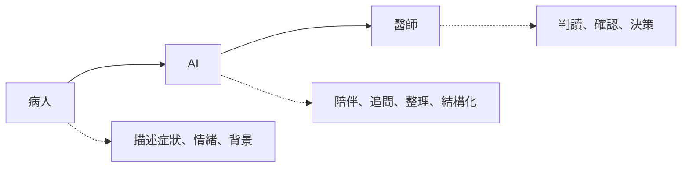
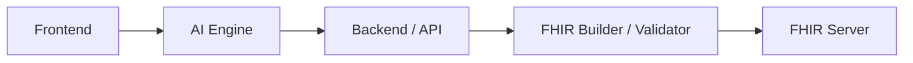

# 情境與使用者分析_三頁簡報文本

更新日期：`2026-05-01`

這份文件是給決賽簡報直接使用的版本，拆成 3 頁，每頁都包含：

1. 投影片標題
2. 投影片上建議放的精簡文字
3. 你報告時可直接延伸的講稿

## 開場草稿

如果你要從上一個段落自然轉進這一部分，我建議可以先用這段開場：

`接下來，我想先說明這個系統為什麼成立。`
`我認為這個題目最關鍵的，不只是心理健康需求本身，而是 AI 為什麼特別適合放進這個場景。`
`因為心理健康不是單純填量表就能完成的事情，它裡面有大量情緒、語意、背景與脈絡，而這些剛好是現在生成式 AI 最有機會承接的部分。`
`所以這三頁我想講三件事：第一，為什麼 AI 特別適合心理健康；第二，為什麼不能只靠量表；第三，我這個系統最後為什麼會收斂成病人、心理專業與 FHIR 工程之間的橋樑。`

如果你想要更短、更像答辯現場直接切進去，也可以用這版：

`接下來我想回答一個問題，就是為什麼這個題目一定要用 AI 來做。`
`我認為心理健康最困難的地方，不是有沒有量表，而是病人能不能把真正重要的東西說清楚。`
`而我這個系統的設計，就是想讓 AI 先接住這些原始敘述，再把它整理成醫師真正用得上的資料。`

## 第 1 頁：為什麼 AI 特別適合心理健康場景

### 投影片標題

`AI 特別適合承接心理健康中的前段互動與整理工作`

### 投影片文字

- 能長時間、低壓力地陪伴使用者互動
- 能處理大量語意、情緒與背景脈絡
- 能先蒐集，再整理，再轉成可用資料
- 特別適合承接診前高耗能的前段工作
- 心理健康需求持續擴大，傳統單次量表難承接日常波動

### 講稿版本

如果今天只是一般醫療資料輸入，其實不一定需要 AI。  
但心理健康這個場景不太一樣，因為它裡面有大量敘述性、情緒性、脈絡性的內容，不是只靠幾個欄位就能填完。

我認為 AI 特別適合這個場景的原因，在於它可以長時間、低壓力地和使用者互動。使用者不需要在短短幾分鐘內一次講清楚自己，也不需要承受立即被判斷的壓力，而是可以先慢慢把情緒、症狀、生活背景和脈絡說出來。

更重要的是，AI 不是只把話記下來，它還能處理語意、情緒和上下文之間的關係。也就是說，它不只是收集，而是能先做初步理解與整理，這對心理健康場景非常關鍵。

這一點其實也和外部研究觀察一致。無論是 WHO、OECD 對心理健康需求與系統缺口的描述，還是 EMA 對於即時、連續資料收集價值的強調，都在說明一件事：心理健康問題不是靠一次填表就能完整理解的，它更需要能承接日常波動的互動方式。

所以對我來說，AI 在這裡最有價值的地方，不是取代專業，而是承接那些原本很耗時間、很需要耐心、但醫療現場最難負擔的前段互動工作。

## 第 2 頁：為什麼是 AI，而不是只有量表或問卷

### 投影片標題

`真正困難的不是量化症狀，而是理解症狀背後的原因與脈絡`

### 投影片文字

- 症狀可量化，但背景與原因需要時間理解
- 診間時間有限，病人常無法完整表達
- 單次量表難承接日常生活中的連續變化
- AI 可先蒐集敘述，再整理成可交接資訊
- Woebot / Wysa / EMA 都支持連續互動式資料收集的價值

### 講稿版本

我認為心理健康場景裡最難的事情，不是把症狀分數填出來，而是理解症狀背後的原因、觸發點、生活脈絡和功能影響。  
很多症狀其實可以量化，但真正對判讀有幫助的，往往是那些敘述性的背景資料。

但這正好是醫療現場最難負擔的一段。因為醫師時間有限，病人又常常在診間裡講得零散、片段，甚至因為緊張而漏掉真正重要的內容。傳統量表雖然有價值，但大多偏向單次填寫，比較難承接日常生活中的動態變化。

所以我會選擇 AI，不是因為它比專業人員更懂診斷，而是因為它可以在診前先用更低成本做前段蒐集與整理。病人先對 AI 講出來，AI 再把原始敘述整理成醫療端可用的資訊，這樣醫師才更容易快速進入重點。

這個方向其實也不是只有理念上的推論。像 Woebot 和 Wysa 的研究，都顯示對話式 AI 至少能成為一個有效的前段互動介面；而 EMA 相關方法則指出，與其依賴事後回憶，不如在真實生活情境中持續收集資料，這樣更能接近心理狀態的實際波動。

也因為這樣，AI 的價值不是停在聊天，而是停在「聊天之後能不能整理出可交接的資料」。這才是它在心理健康市場真正適合的原因。

## 第 3 頁：我的產品定位是什麼

### 投影片標題

`AI 串起諮商心理、臨床心理與 FHIR 工程，成為病人到醫師之間的橋樑`

### 投影片文字

- 靈感來自 `ChatGPT-4o` 的語意理解與陪伴能力
- 諮商心理重視陪伴與關係建立
- 臨床心理重視評估、症狀辨識與判讀
- FHIR 工程負責結構化、標準化與可交換性
- AI 將三者串起來，但不取代醫師判斷
- FHIR 讓整理結果不只是摘要，而是可交換、可追蹤的醫療資料
- 同時必須限制 AI 過激行為，強化安全邊界

### 講稿版本

我自己的開發動機，其實很大一部分來自 ChatGPT-4o 的問世。  
它讓我第一次很強烈地感受到，AI 已經不只是回答問題，而是真的能在複雜語意情境裡做分析、解釋、安慰與延伸追問。

但我也發現，大家常常只看到它「很會安慰人」，卻忽略它背後其實同時包含了大量心理學知識、語境理解與對話能力。這讓我開始思考，如果把這種能力放進更受控制、更貼近醫療流程的系統裡，它是不是可以成為一個真正有用的橋樑。

我後來慢慢意識到，這個題目其實剛好卡在三種能力的交界。  
第一個是諮商心理，它更重視陪伴、理解、關係建立，讓使用者願意說。第二個是臨床心理，它更在意評估、症狀辨識與判讀，讓資訊有臨床意義。第三個則是 FHIR 工程，它要求資料最終能被結構化、標準化，並且真的可以被系統使用。

一般情況下，很少會有單一角色同時熟悉這三件事。心理師未必熟悉 FHIR，FHIR 工程師也未必理解心理互動裡那些微妙的溝通與判讀差異。但 AI 剛好可以站在中間，把原始對話先接住，再往兩端整理。

所以我對這個系統的定位非常明確。AI 不取代醫師診斷，它負責的是陪伴、追問、整理、映射；醫師真正負責的，仍然是判讀、確認與最終決策。這樣的設計，才有機會讓病人更敢說，醫師更快看到重點，而資料最後又能直接進入 FHIR 結構。

而 FHIR 在這裡的重要性，不只是因為它是一個競賽要求或標準格式，而是因為它會逼系統進一步思考：哪些內容應該成為 Observation，哪些應保留在 QuestionnaireResponse，哪些適合放進 Composition。也就是說，FHIR 讓 AI 整理出的內容不只是摘要，而是能被醫療系統交換、追蹤、再利用的資料。

但同時，我也很在意安全問題。生成式 AI 在心理健康場景若沒有被控制，可能會讓使用者過度依賴，甚至在脆弱狀態下受到錯誤引導。所以本系統不只追求互動自然，也非常重視對話控制、安全模式與 Human-in-the-loop。我要做的不是一個情緒化的聊天機器，而是一個安全、可控、能夠輔助醫療流程的 AI 工具。

## 三頁的總結建議

如果你要把這三頁接起來，整段節奏可以是：

1. `先講為什麼是 AI`
   因為心理健康最需要的不是回答，而是理解、陪伴與整理。
2. `再講為什麼不只靠量表`
   因為真正有價值的是症狀背後的原因、背景與脈絡。
3. `最後講你的定位`
   你不是做 AI 心理師，而是在做心理專業與 FHIR 工程之間的橋樑。

## 最後一句收束

你在這個部分最後可以用這句收尾：

`我想做的不是讓 AI 取代醫師，而是讓 AI 先接住病人，再把真正重要的資訊整理給醫師。`

## 補充頁 1：使用者與角色

### 投影片標題

`使用者與角色分工`

### 簡化 Mermaid

### 投影片文字

- 病人提供最原始的症狀、情緒與生活脈絡
- AI 負責前段互動、整理與結構化
- 醫師負責最終判讀與臨床決策
- 系統定位：補足病人到醫師之間的診前資訊斷層

### 講稿版本

這套系統的核心不是單一聊天機器人，而是三方角色之間的協作。  
病人提供的是最原始的內容，也就是自己的症狀、情緒、背景與主觀感受。AI 不做最終判斷，而是位於中間，負責陪伴、追問、整理，並把自然語言慢慢轉成可被理解的資訊。最後，醫師仍然是最終判讀與決策的人。

所以這套系統的真正定位，是讓 AI 先補上病人到醫師之間原本最耗時、最零散、也最容易遺漏的那一段。

## 補充頁 2：系統主流程

### 投影片標題

`從病人對話到醫師可用資訊的主流程`

### 簡化 Mermaid

### 投影片文字

- 病人以自然語言輸入內容
- AI 逐步追問並整理重要資訊
- 系統累積 PHQ-9 / HAM-D 線索
- 生成報表、摘要與 FHIR Draft
- 經授權後交付醫療端使用

### 講稿版本

在流程上，病人一開始不是直接面對一份量表，而是先透過自然語言和系統互動。  
AI 會先做陪伴式回應，再根據內容逐步追問、整理，慢慢累積和症狀、情緒、壓力來源以及功能影響相關的資訊。

接著，系統會把這些內容整理成不同層次的結果，例如病人可閱讀的內容、醫師摘要，以及更結構化的 FHIR Draft。病人在確認與授權之後，這些資料才會被交付到醫療端使用。

所以這個流程不是聊天完就結束，而是從對話開始，一路走到醫師可以真正使用的資訊。

## 補充頁 3：系統架構

### 投影片標題

`系統架構：前端互動、AI 整理與 FHIR 交付`

### 簡化 Mermaid

### 投影片文字

- Frontend：病人端、醫師端、報表與互動畫面
- AI Engine：陪伴、追問、記憶與安全控制
- Backend / API：會話、輸出、授權與交付流程
- FHIR Layer：Bundle Builder、Validator、FHIR Draft
- FHIR Server：醫療端可交換、可追蹤的資料出口

### 講稿版本

在架構上，這套系統可以分成幾個層次。  
最前面是前端介面，包含病人端聊天、量表、報表，以及醫師端的摘要與檢視畫面。中間是 AI Engine，負責陪伴式互動、追問邏輯、記憶與安全控制。再往後是後端與 API，負責會話資料、輸出結果、授權確認與交付流程。

而最關鍵的一層，是 FHIR Layer。這一層不是把內容單純存成文字，而是透過 Builder 和 Validator，把 AI 整理出的資訊轉成標準化醫療資料。最後，這些資料可以送到 FHIR Server，使它不只是摘要，而是可交換、可追蹤、可再利用的資料。

這也是這個系統和一般 AI 陪聊工具最大的差異：它最後的目標不是停在互動，而是停在醫療端真的能接住這份資料。
