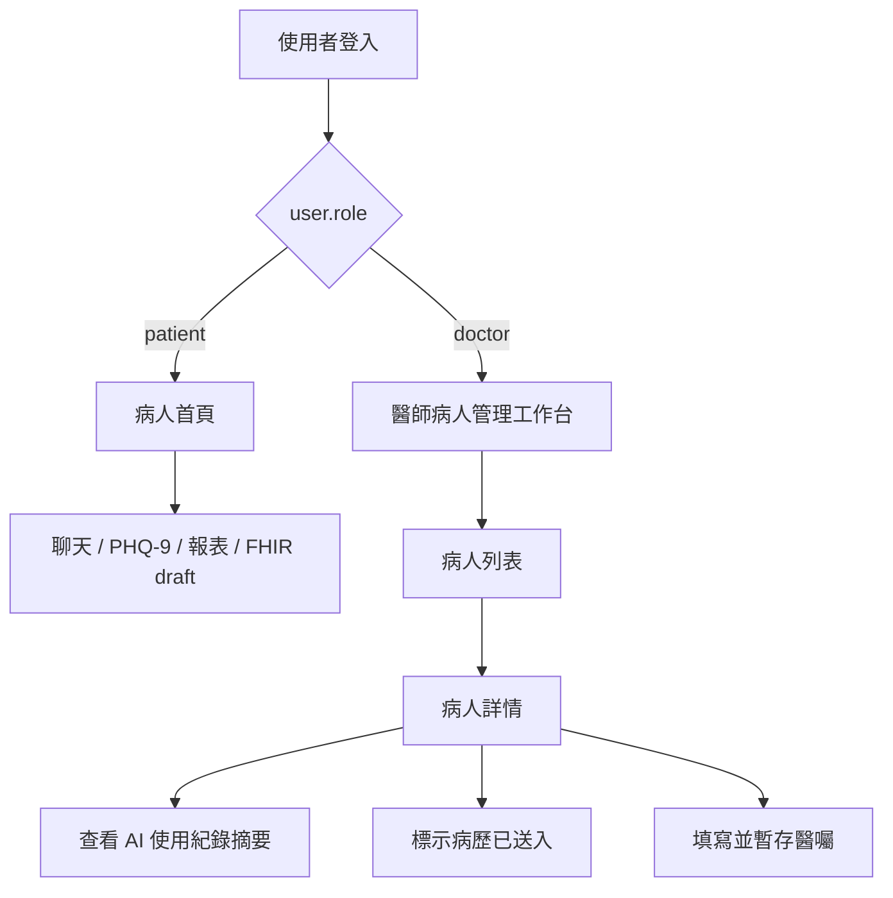
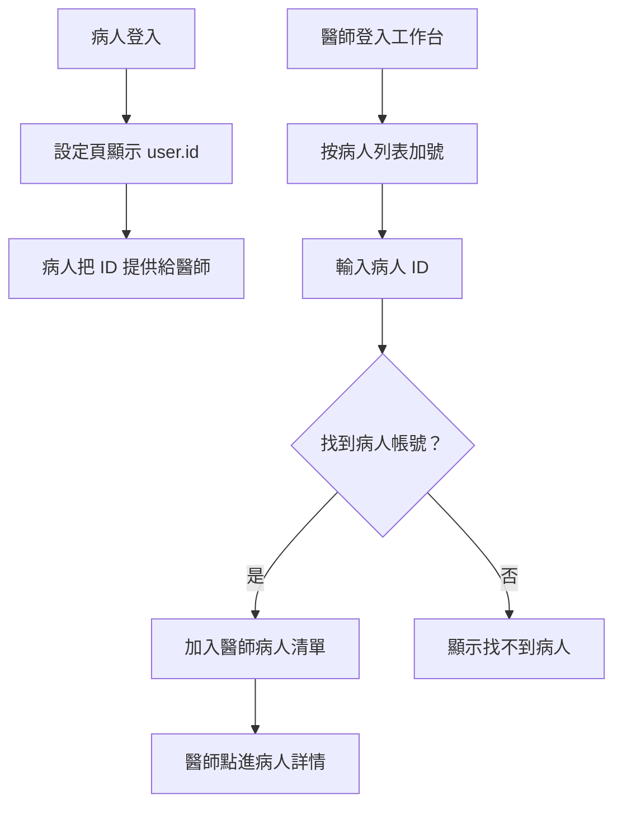

# 醫師端病人管理工作台實作計畫

## 摘要

本計畫把現有「病人單人聊天、PHQ-9、報表與 FHIR draft」流程，補上一個醫師登入後使用的獨立工作台。醫師端第一版不進聊天頁，也不把 Rou Rou 當陪伴對話工具，而是作為「管理病人 AI 使用紀錄與診前處理事項」的 prototype 入口。

這次實作重點是角色分流與畫面責任切開：

- 病人登入後：維持現有聊天、PHQ-9、報表、病人審閱與 FHIR draft 流程。
- 醫師登入後：直接進入 `screen-doctor-dashboard`，查看病人列表與病人詳情。
- 醫師端功能先做展示與本地暫存，不接正式 HIS / EMR / FHIR 寫入。
- 設定頁共用身份區與登出功能，但醫師端返回時回醫師工作台，不回聊天頁。

## 主要變更

### 1. 角色分流

目標：登入成功後依 `user.role` 決定入口，避免醫師看到病人聊天首頁。

最小行為：

- `patient`：進入原本病人首頁，可繼續聊天、PHQ-9、報表與 FHIR draft。
- `doctor`：進入 `screen-doctor-dashboard`。
- 醫師若嘗試進入 `screen-chat`、`screen-phq9`、`screen-report`、`screen-energy`，先導回醫師工作台。

prototype 推薦做法：

- 先沿用現有身份系統的 `user.role`。
- 前端先做硬分流，後續再接 API 權限驗證。

不做的事：

- 不做醫院級 SSO。
- 不做正式院內權限矩陣。
- 不讓醫師端使用病人聊天功能。

驗收方式：

- 病人登入後仍可進入聊天頁。
- 醫師登入後直接看到病人管理工作台。
- 醫師從設定頁返回時回到醫師工作台。

### 2. 醫師端病人列表

目標：讓醫師看到手上病人，而不是進入單一聊天紀錄。

最小欄位：

- `patientNumber`：病人編號。
- `name`：病人姓名。
- `latestAiRecordAt`：最近 AI 記錄時間。
- `aiSummaryStatus`：AI 摘要狀態。
- `medicalRecordStatus`：病歷送入狀態。
- `orderStatus`：醫囑狀態。

prototype 推薦做法：

- 第一版使用前端 demo / `localStorage` 資料。
- 下一版再改接 `CareLink` 或醫師病人清單 API。

不做的事：

- 不查正式資料庫。
- 不做真實醫病綁定查詢。
- 不顯示完整聊天逐字稿。

驗收方式：

- 醫師工作台能看到多位病人。
- 每位病人至少顯示編號、姓名、最近 AI 記錄時間與三種狀態。
- 點選病人後詳情區會切換。

### 3. 病人詳情與 AI 使用紀錄摘要

目標：醫師點進病人後，看到可快速判讀的 AI 使用紀錄摘要。

最小欄位：

- `riskLevel`：風險觀察標記。
- `aiSummary`：AI 使用紀錄摘要。
- `lastVisitNote`：補充說明。
- `medicalRecordStatus`：病歷送入狀態。
- `orderDraft`：醫囑草稿。

prototype 推薦做法：

- 先用整理好的 demo 摘要模擬醫師閱讀場景。
- 詳情區只顯示摘要，不讓醫師端變成聊天介面。

不做的事：

- 不直接揭露所有病人對話內容。
- 不做臨床風險自動診斷。
- 不做正式醫療判讀結論。

驗收方式：

- 醫師點選病人後能看到病人編號、姓名、風險觀察、AI 摘要與補充說明。
- 切換不同病人時詳情內容跟著改變。

### 4. 病歷送入與醫囑填寫 Prototype

目標：先做出醫師工作流程入口，讓展示時能看懂「醫師可以處理病人資料」。

最小欄位：

- `medicalRecordStatus`：`待送入` / `已送入`。
- `orderDraft`：醫囑草稿內容。
- `orderStatus`：`未填寫` / `草稿中` / `已暫存`。

prototype 推薦做法：

- 「標示為已送入」只更新本地狀態。
- 「暫存醫囑」只存到 `localStorage`。
- 介面明確標示不會真的寫入 HIS / EMR / FHIR。

不做的事：

- 不呼叫正式 HIS / EMR。
- 不建立正式 FHIR 寫入紀錄。
- 不做電子簽章、醫囑簽核或處方流程。

驗收方式：

- 醫師可以把病歷送入狀態切成 `已送入`。
- 醫師可以輸入醫囑並暫存。
- 重新整理後 prototype 狀態仍可保留於本機。

### 5. 後續遞進：用病人 ID 加入真實病人

目標：醫師端不應永遠只顯示 placeholder / demo 病患，而是要逐步進到「醫師可以按加號，輸入病人 ID，加入此病患資料」的真實使用感。

最小行為：

- 每個帳號都要有可辨識的 `user.id`。
- 病人可在設定頁看到自己的病人 ID，並能告知醫師。
- 醫師端病人列表右上角新增「加號」入口。
- 醫師按下加號後，輸入病人的 ID。
- 系統找到該病人帳號後，把此病人加入醫師的病人清單。
- 加入後，醫師可在病人列表點進該病人，看到該病人的基本資料與可用摘要區。

prototype 推薦做法：

- 第一階段先使用現有身份系統的 `user.id` 當作病人 ID。
- 設定頁身份區顯示目前登入者的 `user.id`，病人與醫師都看得到自己的帳號 ID。
- 醫師端新增 `+` 按鈕與簡易輸入彈窗，例如「輸入病人 ID」。
- 第一版可先從本地或簡化 auth store 查找病人帳號，成功後存到醫師端 `doctorWorkspace.patients`。
- 若暫時無法取得完整病人資料，至少先以 `patient_id`、`display_name`、`login_identifier` 建立列表項目，AI 摘要狀態可顯示 `尚未整理`。

不做的事：

- 不先做正式醫院病患名單同步。
- 不先做複雜邀請碼、QR code 或雙方確認流程；那些會接在 `CareLink` 正式綁定階段。
- 不允許醫師只靠任意姓名加入病人，必須用穩定 ID，避免同名病人混淆。
- 不在加入病人時直接開放所有敏感資料；可先只顯示基本身份與空摘要狀態。

驗收方式：

- 病人登入後可在設定頁看到自己的 ID。
- 醫師登入後可在病人列表看到加號。
- 醫師輸入存在的病人 ID 後，病人會出現在醫師清單。
- 醫師輸入不存在的 ID 時，系統會顯示找不到病人。
- 加入後重新整理頁面，醫師清單仍保留該病人。
- demo placeholder 病患可以保留作展示資料，但新增病人要能和 demo 病患分辨。

後續升級方向：

- 第二階段把「醫師輸入病人 ID」升級成 `CareLink` 綁定請求。
- 第三階段加入病人同意：病人端收到綁定邀請後確認，醫師才能看到更完整的 AI 摘要。
- 第四階段再接邀請碼 / QR code，讓比賽 demo 可以更直覺展示「醫師邀請，病人確認」。

## 資料模型

```js
DoctorWorkspace = {
  selectedPatientId: string,
  patients: DoctorPatient[]
}

DoctorPatient = {
  id: string,
  patientNumber: string,
  name: string,
  latestAiRecordAt: string,
  aiSummaryStatus: string,
  medicalRecordStatus: string,
  orderStatus: string,
  riskLevel: string,
  aiSummary: string,
  lastVisitNote: string,
  orderDraft: string
}

User = {
  id: string,
  role: "patient" | "doctor",
  display_name: string,
  login_identifier: string,
  status: string
}

DoctorPatientLinkDraft = {
  doctor_id: string,
  patient_id: string,
  source: "manual_id",
  link_status: "local_added" | "pending_patient_confirm" | "active",
  added_at: string
}
```

## 流程



### 後續加入病人流程



## 驗收標準

- 醫師登入後不會進入聊天頁，而是進入醫師工作台。
- 病人登入後原有聊天、PHQ-9、報表與 FHIR draft 流程仍可使用。
- 醫師端病人列表顯示病人編號、姓名、最近 AI 記錄時間、AI 摘要狀態、病歷送入狀態、醫囑狀態。
- 醫師可點選病人並查看 AI 使用紀錄摘要。
- 醫師可操作「標示為已送入」與「暫存醫囑」。
- 醫師登出後回到登入彈窗；再用病人登入時不殘留醫師頁作為主入口。
- 下一階段完成後，設定頁需顯示目前帳號 ID，醫師可用加號輸入病人 ID 加入病人。

## 預設假設

- 第一版醫師端只做 prototype UI 與本地暫存，不接正式資料庫。
- 醫師的病人清單先用 demo 資料，下一階段再接 `CareLink`。
- 醫師不需要聊天功能，也不顯示 PHQ-9 浮動按鈕。
- 病歷送入與醫囑填寫先做入口與狀態展示，不做真正醫療資料送出。
- 新增病人功能會先用現有 `user.id` 當作病人 ID；正式授權與雙方確認留到 `CareLink` 階段。
- 既有 `.logs/fhir-delivery-debug.ndjson` 變更不納入本次提交。
