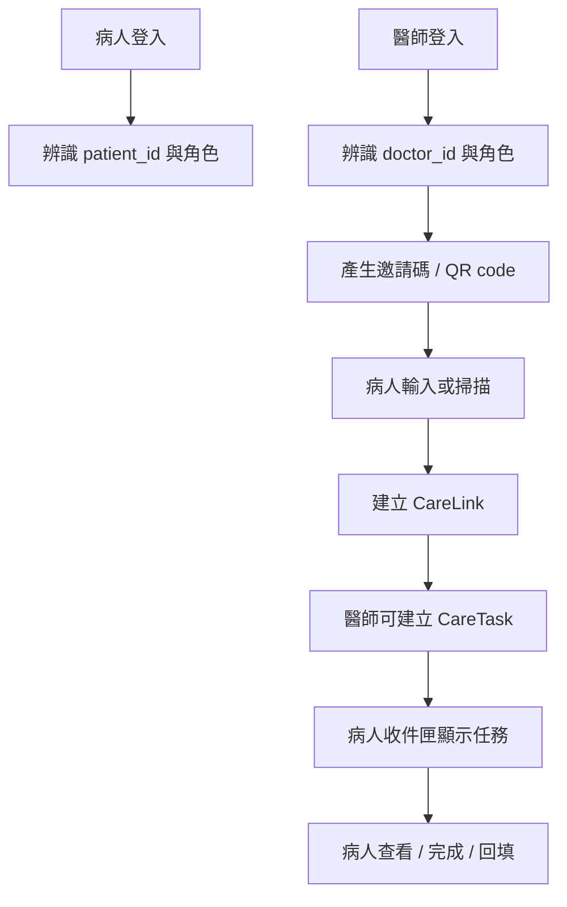

# 醫病雙角色協作與任務投遞升級計畫

更新日期：`2026-04-24`

## 摘要

這份計畫是把目前偏向「病人單人整理工具」的 AI Companion，升級成「病人與醫師都能進入、互相授權、定向投遞、清楚收件」的雙角色 prototype 路線圖。  
這一版重點不是先把資料傳出去，而是先把「誰是誰」、「誰可以對誰互動」、「送出的東西要落在哪裡」這三件事建立起來。

目前專案已經有 `patient_profile`、`patient_review_packet`、`patient_authorization_state`、`fhir_delivery_draft` 等單病人流程骨架，代表病人整理、病人審閱、病人授權、FHIR 草稿輸出這條線已經有雛形。  
現在真正缺的不是 FHIR 生成能力本身，而是正式的身分層、醫病授權層、任務投遞層，以及病人端的任務承接入口。

因此，這次升級會把系統從「病人自己整理資料」推進到「醫師與病人可以在被授權的關係下協作」，作為第一版產品化補強。

## 主要變更

### 1. 身分系統

目標是先讓系統知道誰是病人、誰是醫師，並且在登入後能穩定辨識使用者身份與角色權限。

最小資料欄位：

- `User.id`
- `User.role`
- `User.display_name`
- `User.login_identifier`
- `User.status`

prototype 推薦做法：

- 新增病人與醫師兩種角色，不再只用 `web-demo-user` 這種單一概念。
- 登入先採簡化帳號系統，可用帳號密碼或展示用固定憑證，不先碰醫院級 SSO。
- 角色登入後，session 狀態要能區分「目前登入者」與其對應的 `patient_id` 或 `doctor_id`。
- 所有後續醫病關係與任務指派，都以穩定的 `patient_id`、`doctor_id` 為主鍵，而不是只靠姓名辨識。

不做的事：

- 不在這一版導入院內 AD、SSO、健保卡或醫事人員卡驗證。
- 不在這一版處理正式醫療機構級的帳號審核流程。

驗收方式：

- 病人可登入並被系統辨識為病人。
- 醫師可登入並被系統辨識為醫師。
- 前後端狀態中可明確取得目前登入者身份與角色。
- 後續功能判斷不再依賴單一 demo user。

### 2. 醫病關係綁定

目標是建立一層正式的授權關係，讓系統知道哪一位醫師可以對哪一位病人互動，而不是任何醫師都能任意送資料給任何病人。

最小資料欄位：

- `CareLink.id`
- `CareLink.doctor_id`
- `CareLink.patient_id`
- `CareLink.link_status`
- `CareLink.authorized_at`
- `CareLink.invitation_code`

prototype 推薦做法：

- 以邀請碼與 QR code 為主路徑，因為最直覺、最好展示，也最適合競賽或 prototype 場景。
- 醫師端可建立邀請碼或 QR code。
- 病人端輸入邀請碼或掃描 QR code 後完成綁定。
- 綁定成功後，系統建立 `CareLink` 紀錄，作為後續任務投遞與資料檢視的授權依據。
- `link_status` 至少要能區分 `pending`、`authorized`、`revoked`。

不做的事：

- 不在這一版直接接 HIS / EMR。
- 不在這一版處理跨院區、多科、多主治共享授權規則。

驗收方式：

- 醫師可成功產出邀請碼或 QR code。
- 病人可透過邀請碼或 QR code 完成綁定。
- 未綁定時，醫師不可對該病人建立正式任務。
- 已綁定時，系統可正確查出該醫病配對關係。

### 3. 任務 / 訊息投遞系統

目標是把醫師送出的內容改造成「任務」或「待處理項目」，而不是直接把資料亂丟進病人端。

最小資料欄位：

- `CareTask.id`
- `CareTask.sender_id`
- `CareTask.receiver_id`
- `CareTask.task_type`
- `CareTask.title`
- `CareTask.message`
- `CareTask.status`
- `CareTask.due_date`
- `CareTask.linked_fhir_resource`

prototype 推薦做法：

- 任務建立者預設為醫師，接收者預設為病人。
- `task_type` 至少支援：`questionnaire`、`summary_review`、`message`、`follow_up_task`。
- `status` 至少支援：`unread`、`read`、`completed`、`expired`。
- `linked_fhir_resource` 可先存放對應的 `QuestionnaireResponse`、`Composition`、`DocumentReference` 或後續 FHIR 草稿參照資訊。
- 醫師上傳或指派內容時，實際上是在系統建立一筆 `CareTask`，再由病人端收件匣承接。

不做的事：

- 不把這一版做成即時聊天室或複雜通知中心。
- 不在這一版加入多層審批、多人會辦或推播排程中心。

驗收方式：

- 醫師可對已綁定病人建立任務。
- 任務可帶有類型、標題、訊息、截止時間與關聯資源。
- 未綁定病人不可被建立正式任務。
- 病人端可查到屬於自己的任務清單。

### 4. 病人端收件匣 / 任務盒

目標是讓病人端有一個清楚入口，能看到醫師新指派的內容、待補件項目與完成狀態，不然資料送過去也沒有意義。

最小顯示欄位：

- 任務標題
- 發送者醫師名稱
- 任務類型
- 狀態
- 截止日期
- 連結到對應內容或 FHIR 資源

prototype 推薦做法：

- 在病人端新增 `收件匣`、`任務中心` 或 `待處理事項` 入口。
- 預設依未讀、待完成、已完成做清楚分層。
- 每筆任務可打開查看醫師指派內容，例如 PHQ-9、睡眠追蹤表、補充說明或診前摘要確認。
- 任務完成後，狀態回寫為 `completed`，保留病人可追溯的紀錄。

不做的事：

- 不在這一版把病人端收件匣與一般聊天訊息混在一起。
- 不在這一版做過度複雜的標籤、資料夾與自訂規則。

驗收方式：

- 病人登入後可看到屬於自己的任務入口。
- 新任務能清楚顯示為未讀或待處理。
- 任務完成後可更新狀態。
- 病人能分辨哪些是醫師剛指派、哪些已完成、哪些已逾期。

## Prototype 實作策略

這一版以競賽 / demo / prototype 為優先，不走正式醫療院所上線規格。

1. 身分管理先簡化
- 不做正式醫院級帳號治理。
- 不碰複雜院內 SSO。
- 重點是角色可分、身份可辨、醫病關係可驗證。

2. 儲存方式先沿用現況
- 預設沿用現有 Node server 與 `.data` 檔案式儲存思路擴充。
- 先做出可展示的資料流，不急著先定正式 DB。
- 後續若要升級資料庫，再把 `User`、`CareLink`、`CareTask` 轉入正式 schema。

3. 綁定路徑先做最好展示的版本
- 主流程採「醫師產邀請碼 / QR code，病人輸入或掃描完成綁定」。
- HIS / EMR 名單授權只列為未來擴充，不列入這版核心交付。

4. 相容原則先講清楚
- 現有聊天、病人審閱、病人授權、FHIR draft 不拆掉。
- 這些既有流程先保留，後續再掛到新的雙角色任務流之下。
- 換句話說，這版是補「身份與投遞骨架」，不是推倒重練整個 AI Companion。

## 資料模型與流程草圖

### 建議資料模型

`User`

- `id`
- `role`
- `display_name`
- `login_identifier`
- `status`

`CareLink`

- `id`
- `doctor_id`
- `patient_id`
- `link_status`
- `authorized_at`
- `invitation_code`

`CareTask`

- `id`
- `sender_id`
- `receiver_id`
- `task_type`
- `title`
- `message`
- `status`
- `due_date`
- `linked_fhir_resource`

### 建議流程

1. 病人登入流程
- 病人輸入登入資訊。
- 系統辨識角色為 `patient`。
- 載入病人專屬 session、病人 ID 與病人收件匣。

2. 醫師登入流程
- 醫師輸入登入資訊。
- 系統辨識角色為 `doctor`。
- 載入醫師專屬 session、醫師 ID 與其可互動的病人清單。

3. 醫病綁定流程
- 醫師建立邀請碼或 QR code。
- 病人輸入邀請碼或掃描 QR code。
- 系統建立 `CareLink` 並把狀態設為 `authorized`。
- 之後醫師才可對這位病人建立任務。

4. 醫師建立任務到病人收件匣流程
- 醫師在已綁定病人頁面建立任務。
- 系統建立 `CareTask`。
- 病人登入後，在收件匣 / 任務中心看到該筆指派內容。
- 病人查看、回填或完成後，系統更新任務狀態。

## 對外介面與後續 API 方向

這一版文件不先把最終 API 完全定死，但需要先把方向講明白，避免後續實作時又回到單一使用者思維。

建議概念層 API：

- `POST /auth/login`
- `POST /care-links/invite`
- `POST /care-links/bind`
- `POST /care-tasks`
- `GET /patient/inbox`

同步要明講的外部行為變更：

- 系統新增雙角色登入與角色判斷。
- session / state 後續要能分辨「目前登入者」與「目前目標病人」。
- 任務不再是散落輸出，而是有明確接收者、狀態與入口的投遞物件。

## 驗收與評估重點

- 文件讀完後，能清楚看出四個模組的先後順序與依賴關係。
- 文件讀完後，能回答「醫師如何被辨識」、「病人如何被辨識」、「誰有權互動」、「病人在哪裡看到被指派內容」。
- 每個模組都要有目標、最小資料欄位、prototype 推薦做法、不做的事、驗收方式。
- 文件內容需延續現有計畫文件風格，以中文主題式命名與可直接評估的段落結構呈現。

## 預設假設

- 這份文件是四項需求的總計畫，不只處理第一項。
- 第一版目標是競賽 / prototype 可展示，不追求正式醫院上線等級。
- 病人與醫師皆有帳號，但註冊與驗證流程可先簡化。
- 醫病綁定以邀請碼 / QR code 為主，HIS / EMR 僅列為未來擴充。
- 任務盒是指定交付入口，不是一般聊天室替代品。
- 文件新增位置預設為 `工程文件入口/計畫文件`。
